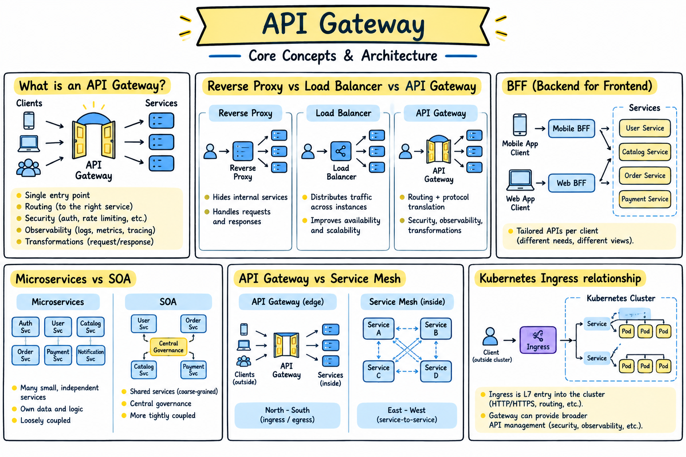
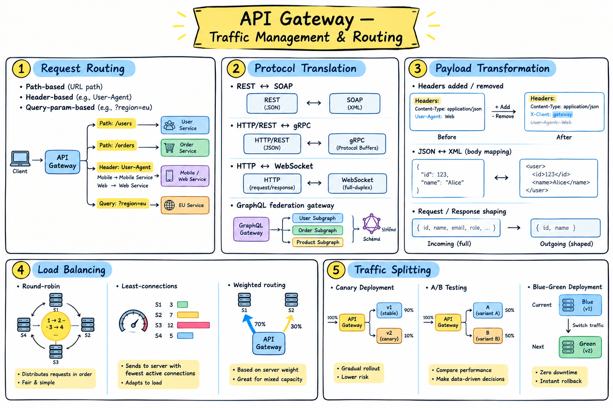
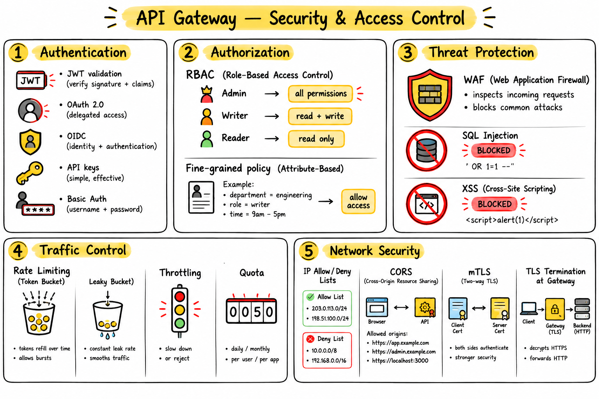
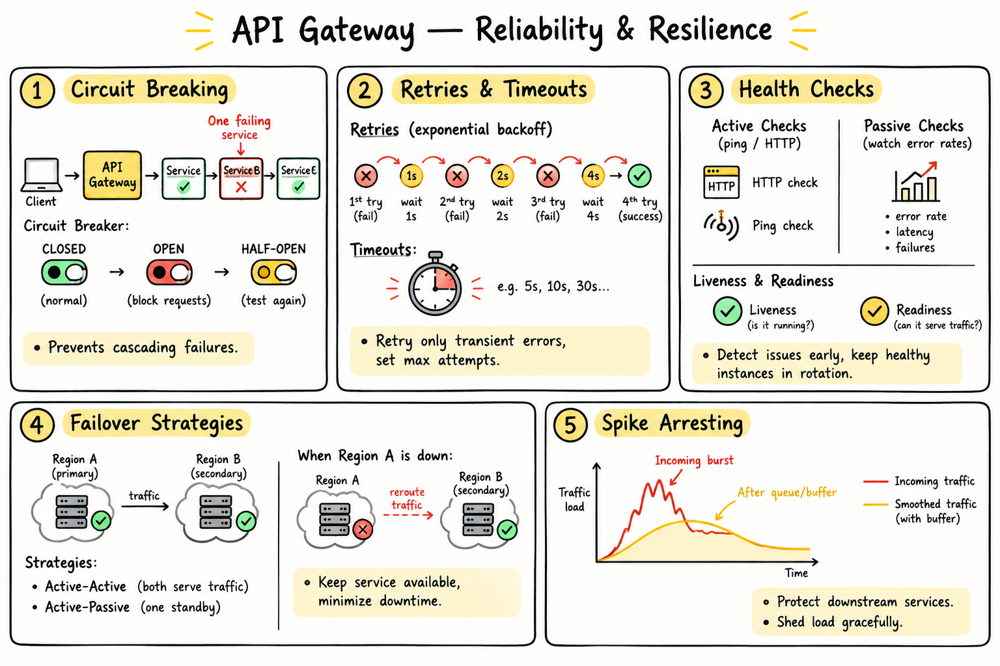
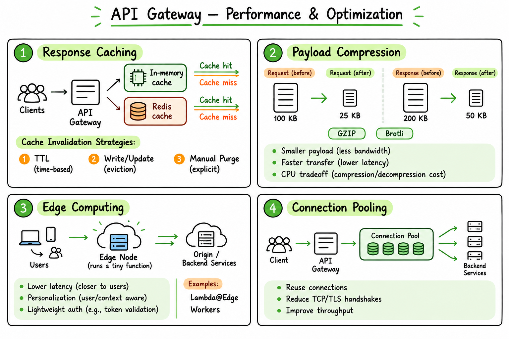
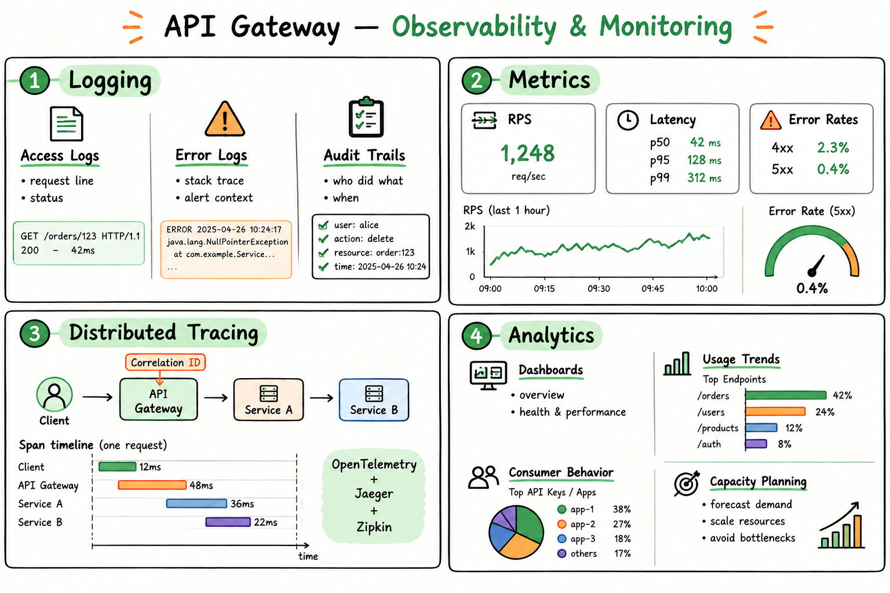
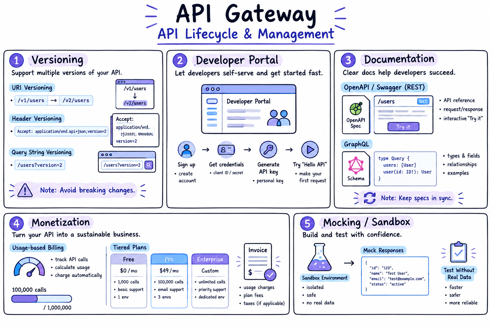
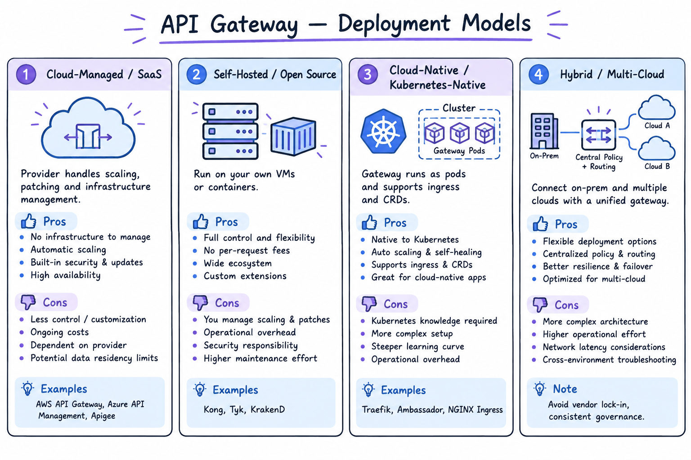
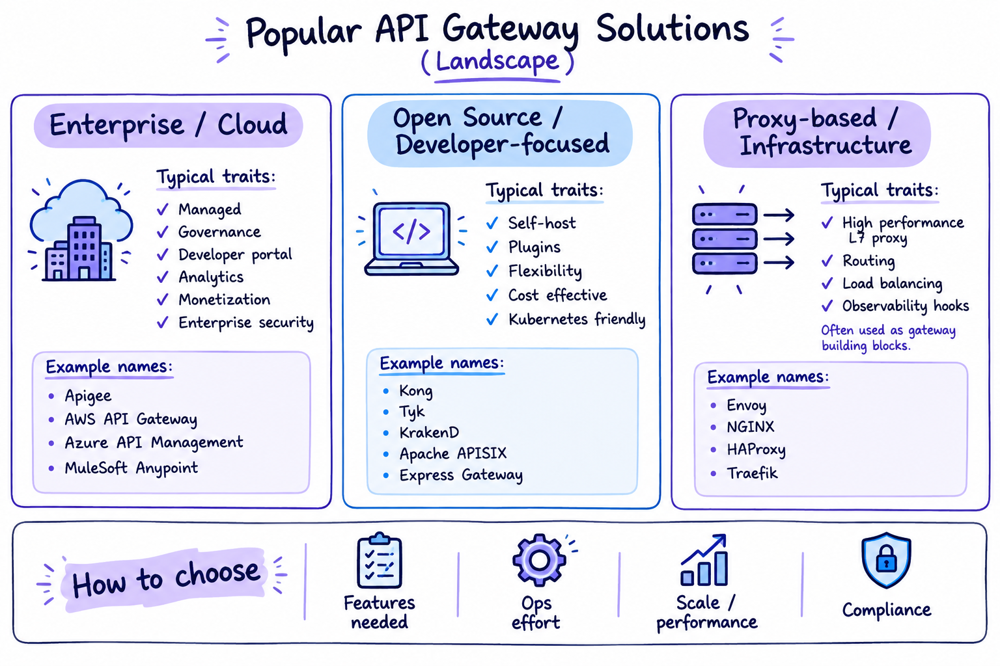

# Prompt
You must to list all topics and sub-topics regarding API Gateway.

# getmerlin.in

Here is a comprehensive breakdown of the topics and sub-topics regarding API Gateways:

**1. Core Concepts and Architecture**
*   Definition and purpose of an API Gateway
*   API Gateway vs. Reverse Proxy vs. Load Balancer
*   The Backend for Frontend (BFF) pattern
*   Role in Microservices and Service-Oriented Architecture (SOA)
*   API Gateway vs. Service Mesh (e.g., Envoy, Istio)
*   Ingress Controllers (Kubernetes) and their relationship to API Gateways

**2. Traffic Management and Routing**
*   **Request Routing:** Path-based, header-based, and query-parameter-based routing
*   **Protocol Translation:** Rest to SOAP, HTTP/REST to gRPC, WebSockets, GraphQL federation
*   **Payload Transformation:** Modifying request/response headers, body mapping (JSON to XML, etc.)
*   **Load Balancing:** Round-robin, least connections, weighted routing
*   **Traffic Splitting:** Canary releases, A/B testing, blue-green deployments

**3. Security and Access Control**
*   **Authentication:** JWT validation, OAuth 2.0, OpenID Connect (OIDC), API keys, Basic Auth
*   **Authorization:** Role-Based Access Control (RBAC), fine-grained access policies
*   **Threat Protection:** Web Application Firewall (WAF) integration, SQL injection protection, Cross-Site Scripting (XSS) prevention
*   **Traffic Control:** Rate limiting (token bucket, leaky bucket), throttling, quota management
*   **Network Security:** IP whitelisting/blacklisting, CORS (Cross-Origin Resource Sharing) management, mutual TLS (mTLS), SSL/TLS termination

**4. Reliability and Resilience**
*   **Circuit Breaking:** Preventing cascading failures across microservices
*   **Retries and Timeouts:** Configuring automatic retries for transient failures
*   **Health Checks:** Active and passive monitoring of backend targets
*   **Failover Strategies:** Routing traffic to secondary regions or standby servers
*   **Spike Arresting:** Smoothing out sudden bursts in API traffic

**5. Performance and Optimization**
*   **Response Caching:** In-memory caching, Redis integration, cache invalidation strategies
*   **Payload Compression:** GZIP, Brotli
*   **Edge Computing:** Executing lightweight functions at the gateway level (e.g., AWS Lambda@Edge, Cloudflare Workers)
*   **Connection Pooling:** Managing persistent connections to backend services

**6. Observability and Monitoring**
*   **Logging:** Access logs, error logs, audit trails
*   **Metrics:** Tracking requests per second (RPS), latency, error rates (4xx/5xx codes)
*   **Distributed Tracing:** Integration with OpenTelemetry, Jaeger, Zipkin (injecting correlation IDs)
*   **Analytics:** Dashboards, API usage trends, consumer behavior analysis

**7. API Lifecycle and Management**
*   **Versioning:** URI versioning, header versioning, query string versioning
*   **Developer Portal:** Self-service onboarding, API key generation
*   **Documentation:** Hosting OpenAPI (Swagger) specifications, GraphQL schemas
*   **Monetization:** Usage-based billing, tier-based subscription models
*   **Mocking:** Providing sandbox environments and mock responses for testing

**8. Deployment Models**
*   **Cloud-Managed / SaaS:** Fully managed services (e.g., AWS API Gateway, Azure API Management, Google Cloud Apigee)
*   **Self-Hosted / Open Source:** Running gateways on VMs or containers (e.g., Kong, Tyk, KrakenD)
*   **Cloud-Native / Kubernetes-Native:** Gateways built for K8s environments (e.g., Traefik, Ambassador, NGINX Ingress)
*   **Hybrid / Multi-Cloud Gateways:** Managing APIs across disparate infrastructure

**9. Popular API Gateway Solutions**
*   **Enterprise / Cloud:** Apigee, AWS API Gateway, Azure API Management, MuleSoft Anypoint
*   **Open Source / Developer-focused:** Kong, Tyk, KrakenD, Apache APISIX, Express Gateway
*   **Proxy-based / Infrastructure:** Envoy, NGINX, HAProxy, Traefik

