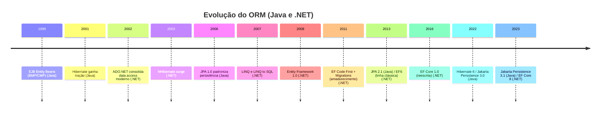
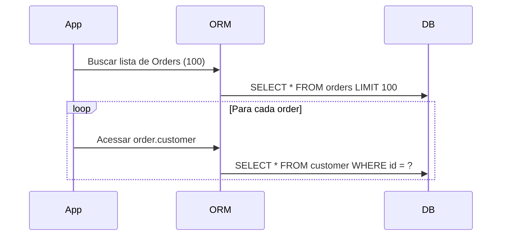

# Prompt
Criar um eBook abrangente sobre ORM (Mapeamento Objeto-Relacional), intitulado 'Dominando ORM, do zero ao profissional - Uma visão Java e .Net'. O eBook deve explorar a evolução histórica das soluções de ORM, começando com EJB (Enterprise JavaBeans), continuando com Hibernate, NHibernate, JPA (Java Persistence API), Entity Framework, e outras soluções relevantes. O foco principal deve ser nas plataformas Java e .Net.

Organize o conteúdo em ordem cronológica, destacando:

O surgimento e evolução das primeiras soluções de ORM.
Os principais marcos e inovações em cada plataforma (Java e .Net).
As razões por trás do desenvolvimento de novas soluções ou melhorias nas existentes.


Para cada solução ou versão significativa de ORM, discuta:

Os desafios que ela pretendia resolver.
As melhores práticas de implementação.
Casos de estudo que ilustrem tanto o sucesso quanto o fracasso no uso dessas tecnologias.
Lições aprendidas e como elas influenciaram o desenvolvimento de soluções subsequentes.


Ao longo do eBook, inclua:

Exemplos práticos de código para as plataformas Java e .Net, mostrando como implementar ORM de forma eficaz.
Análise de casos reais de uso de ORM, destacando desafios enfrentados e como foram superados.
Discussão sobre as tendências atuais e futuras em ORM, incluindo novas tecnologias e abordagens.


Formato do eBook:

Incluir ilustrações, diagramas e trechos de código para facilitar a compreensão.
Utilizar uma linguagem clara e acessível, evitando jargões excessivamente técnicos quando possível.
Incluir sumário detalhado e referências para leituras adicionais.


Critérios de qualidade:

Precisão técnica e atualidade das informações.
Clareza e organização do conteúdo.
Relevância dos exemplos e casos de estudo para o público-alvo (desenvolvedores Java e .Net).

O objetivo é criar um recurso valioso e informativo que ajude os desenvolvedores a entender a evolução do ORM, suas melhores práticas e como aplicá-los eficazmente em projetos reais.

# Abacus
### Dominando ORM, do zero ao profissional — Uma visão Java e .NET  
**Um eBook abrangente sobre Mapeamento Objeto‑Relacional (ORM)**  
**Público-alvo:** desenvolvedores Java e .NET (do júnior ao sênior), arquitetos e tech leads  
**Objetivo:** entender *por que* ORMs surgiram, *como* evoluíram, *onde* dão certo, *onde* falham e *como* aplicar com maturidade em projetos reais.

---

### Sumário detalhado

1. **Introdução**
   1. O que é ORM (e o que não é)
   2. O “problema de impedância objeto‑relacional”
   3. Quando ORM é a ferramenta certa (e quando não é)
2. **Pré‑história do ORM (anos 90 → início dos 2000)**
   1. JDBC/ODBC, SQL “na mão”, Stored Procedures e o nascimento do “DAO”
   2. Primeiros mapeadores e padrões (Active Record, Data Mapper)
3. **Era EJB (Java) — Entity Beans, CMP/BMP e lições duras**
   1. Por que EJB apareceu
   2. O que EJB Entity Beans tentava resolver
   3. Por que doeu (complexidade, acoplamento e performance)
   4. Lições que influenciaram o Hibernate e o JPA
4. **Hibernate (Java) — o ORM “prático” ganha o mundo**
   1. O que ele inovou: POJOs, mapeamento flexível, HQL, caching
   2. Boas práticas e armadilhas clássicas
   3. Casos de sucesso e fracasso
5. **NHibernate (.NET) — Hibernate “renasce” no ecossistema Microsoft**
   1. Motivação histórica e ganhos
   2. Mapeamento (XML/Fluent), sessões, transações
   3. Casos reais: produtividade vs. tuning
6. **Padronização Java: JPA (Java Persistence API)**
   1. Por que padronizar (e o que muda)
   2. EntityManager, JPQL, Criteria, metamodel
   3. JPA na prática com Hibernate/EclipseLink
7. **Mundo .NET: ADO.NET → LINQ to SQL → Entity Framework**
   1. ADO.NET e o “gap” até um ORM oficial
   2. LINQ: a grande virada na linguagem
   3. Entity Framework: do Database‑First ao Code‑First e migrations
8. **Entity Framework Core (.NET) — reescrita, cross‑platform e performance**
   1. Por que o EF Core nasceu
   2. Mudanças arquiteturais e maturidade por versões
   3. Boas práticas modernas (tracking, compiled queries, split queries)
9. **Soluções relevantes “na órbita do ORM”**
   1. Micro‑ORMs (Dapper e afins) e por que existem
   2. MyBatis/iBATIS (mapeamento orientado a SQL) e o “meio termo”
   3. jOOQ (SQL tipado) como alternativa ao ORM clássico
10. **Boas práticas profissionais (Java e .NET)**
   1. Modelagem, agregados, boundaries e mapeamento
   2. Transações, Unit of Work, consistência e concorrência
   3. Performance: N+1, fetch plan, batching, índices, caching
   4. Observabilidade: logs SQL, tracing, métricas, profiling
11. **Estudos de caso (sucesso e fracasso)**
   1. E‑commerce com leitura pesada (sucesso)
   2. ERP com domínio complexo e relatórios (híbrido)
   3. “ORM em tudo” (fracasso) e como recuperar
12. **Tendências atuais e futuras**
   1. Poliglota de persistência (SQL + NoSQL + Search)
   2. “ORM + SQL tipado” e consultas híbridas
   3. Serverless/edge, latência, pooling e limites de abstração
13. **Referências e leituras adicionais**
   1. Livros, conceitos e termos para pesquisa

---

## 1) Introdução

### 1.1 O que é ORM (e o que não é)
**ORM** é uma técnica/ferramenta para mapear objetos (classes) para tabelas (relacional), automatizando:
- materialização de objetos a partir de linhas;
- persistência (INSERT/UPDATE/DELETE);
- relações (1‑N, N‑N, herança);
- controle de identidade e ciclo de vida (ex.: “o mesmo registro = o mesmo objeto na sessão”);
- geração de SQL (parcial ou total).

**ORM não é**:
- um substituto de modelagem de dados;
- uma desculpa para ignorar índices e planos de execução;
- uma garantia de performance.

### 1.2 O problema (impedância objeto‑relacional)
Objetos e bancos relacionais têm visões diferentes do mundo:

- **Objetos**: grafos, identidade por referência, herança, encapsulamento  
- **Relacional**: tabelas, identidade por chave, joins, normalização

ORM nasce para reduzir o custo de traduzir um mundo no outro, mas essa tradução **nunca é perfeita** — só pode ser **bem administrada**.

---

## 2) Linha do tempo (visão cronológica)

Abaixo, um “mapa mental” da evolução (Java e .NET em paralelo):



---

## 3) Era EJB (Java) — Entity Beans, CMP/BMP e lições

### 3.1 Contexto: por que EJB existiu
No fim dos anos 90, construir sistemas corporativos distribuídos exigia:
- transações;
- segurança;
- pooling;
- escalabilidade;
- componentes reusáveis e padronizados.

O EJB prometia isso com “componentes corporativos” gerenciados por container.

### 3.2 O que EJB Entity Beans tentava resolver
EJB Entity Beans ofereciam persistência “corporativa” com duas abordagens:

- **BMP (Bean‑Managed Persistence)**: você escreve a persistência (SQL/JDBC).
- **CMP (Container‑Managed Persistence)**: o container gerencia persistência (o “ORM” do container).

**Problema que tentava resolver:** evitar JDBC “espalhado”, padronizar transações e acesso a dados, reduzir esforço repetitivo.

### 3.3 Por que falhou (na prática)
Principais dores históricas:
- **Complexidade e verbosidade** (interfaces, deployment descriptors, boilerplate).
- **Modelo distribuído “pesado”** (muitas vezes com overhead desnecessário).
- **Acoplamento forte ao container** (testabilidade ruim).
- **Performance imprevisível**, especialmente em cenários de carga e queries complexas.
- **Mapeamento limitado** vs. casos reais de legado.

### 3.4 Lições aprendidas (que influenciaram o futuro)
- “Persistência corporativa” precisa de **POJOs** simples.
- Precisamos separar persistência de infraestrutura distribuída.
- O desenvolvedor precisa ter **controle**: SQL gerado, fetch, caching e transações.

Essas lições abriram espaço para **Hibernate** e, depois, **JPA**.

---

## 4) Hibernate (Java) — o ORM “prático”

### 4.1 O que ele inovou (para a época)
- **POJO-first**: entidades simples, sem precisar herdar framework.
- **Mapeamento flexível** (anotações/XML, herança, relações).
- **HQL/Criteria** (consultas orientadas a domínio).
- **1º nível de cache** (por sessão) e **2º nível** opcional.
- **Lazy loading** como padrão para relações.

### 4.2 Exemplo prático (Java + JPA/Hibernate)
Entidade e relacionamento:

```java
// Java (JPA) - funciona com Hibernate como provider
@Entity
@Table(name = "orders")
public class Order {
  @Id
  @GeneratedValue(strategy = GenerationType.IDENTITY)
  private Long id;

  @ManyToOne(fetch = FetchType.LAZY, optional = false)
  @JoinColumn(name = "customer_id")
  private Customer customer;

  @OneToMany(mappedBy = "order", cascade = CascadeType.ALL, orphanRemoval = true)
  private List<OrderItem> items = new ArrayList<>();

  public void addItem(Product product, int qty, BigDecimal price) {
    var item = new OrderItem(this, product, qty, price);
    items.add(item);
  }
}
```

Consulta evitando N+1 (fetch join):

```java
// JPQL
List<Order> orders = entityManager.createQuery("""
  select o from Order o
  join fetch o.customer
  join fetch o.items
  where o.id = :id
""", Order.class)
.setParameter("id", id)
.getResultList();
```

### 4.3 Melhores práticas (Hibernate/JPA)
- **Transação curta**, sessão curta: evite “sessão por aplicação”.
- Trate ORM como **Unit of Work**:
  - carregue;
  - altere;
  - comite;
  - descarte.
- **Evite N+1**: `join fetch`, EntityGraph, batch fetch.
- **Evite EAGER por padrão**: tende a explodir em joins e custo.
- Use **DTO/projeções** para telas/listagens pesadas.
- Observabilidade:
  - log de SQL (com parcimônia em produção);
  - métricas de tempo de query;
  - tracing por request.

### 4.4 Caso de sucesso (Hibernate)
**Cenário:** e‑commerce com domínio rico (carrinho, pedido, itens, pagamento).  
**Decisão:** modelagem com agregados (Pedido como raiz), transações curtas, `join fetch` em endpoints de leitura crítica, uso de índices e profiling.  
**Resultado:** produtividade alta com performance previsível.

### 4.5 Caso de fracasso (Hibernate)
**Cenário:** listagens de backoffice com grids “infinitos” e muitas relações.  
**Erro típico:** tela acessa `order.getCustomer().getAddress().getCity()` dentro de loop; lazy loading dispara dezenas/centenas de queries (**N+1**).  
**Sintoma:** ambiente de homologação ok, produção lenta sob carga.  
**Correção:** projeções, `fetch join`, paginação correta, índices e limites claros.

---

## 5) NHibernate (.NET) — maturidade antes do ORM “oficial”

### 5.1 Por que NHibernate surgiu
Durante anos, .NET teve ADO.NET muito forte, mas faltava um ORM padrão equivalente ao ecossistema Java. NHibernate levou o modelo mental do Hibernate para .NET:
- sessão como unit of work;
- lazy loading;
- mapeamentos ricos.

### 5.2 Exemplo prático (NHibernate, mapeamento + sessão)
Exemplo conceitual (estilo Fluent; o formato exato pode variar conforme biblioteca):

```csharp
public class Order {
  public virtual long Id { get; protected set; }
  public virtual Customer Customer { get; set; }
  public virtual IList<OrderItem> Items { get; protected set; } = new List<OrderItem>();
}
```

Uso com sessão:

```csharp
using var session = sessionFactory.OpenSession();
using var tx = session.BeginTransaction();

var order = session.Get<Order>(id);
order.Customer.Name = "Novo Nome";

tx.Commit();
```

### 5.3 Melhores práticas (NHibernate)
- Sessão por request (ou por caso de uso), não “global”.
- Cuidado com lazy em serialização (ex.: API retornando grafos).
- Ajuste de fetching e caching por cenário (leitura vs escrita).

---

## 6) JPA — padronização no Java

### 6.1 Por que a plataforma Java criou o JPA
Com múltiplas soluções (Hibernate, TopLink, OpenJPA etc.), faltava:
- **API padrão** (portabilidade);
- melhor integração com servidores e frameworks;
- um “contrato” para o ecossistema.

O JPA **não substitui** provedores; ele define interfaces e comportamento. O Hibernate frequentemente é o provider por baixo.

### 6.2 Inovações e marcos do JPA (alto nível)
- `EntityManager` e contexto de persistência (identidade e rastreamento).
- JPQL padronizado.
- Criteria API (menos string, mais tipos — embora verboso).
- Melhor integração com transações (JTA/Spring).

### 6.3 Padrão prático: Repository/Service
Em Java moderno (ex.: Spring):
- **Service** contém regra de negócio e fronteira transacional.
- **Repository/DAO** encapsula queries.
- **Entidades** não viram “DTO de API”.

Isso evita o “domínio anêmico” e ajuda na testabilidade.

---

## 7) .NET — ADO.NET → LINQ → Entity Framework

### 7.1 ADO.NET: o que resolvia
ADO.NET trouxe:
- `DataReader` performático;
- `DataSet`/`DataTable` desconectados (muito usados em aplicações antigas);
- controle explícito de SQL e conexões.

Mas a ponte objeto‑relacional seguia manual (muito mapeamento repetitivo).

### 7.2 LINQ: marco cultural
LINQ fez consultas virarem parte da linguagem. Isso pavimentou o caminho para ORMs com queries integradas.

### 7.3 Entity Framework: o ORM oficial
O EF evoluiu de abordagens mais “designer/database-first” para:
- **Code First** (domínio primeiro),
- **migrations** e evolução de schema,
- **melhor suporte a testes** e padrões modernos.

---

## 8) EF Core — reescrita e modernização

### 8.1 Por que EF Core nasceu
- Cross-platform (Linux, containers).
- Arquitetura mais modular e enxuta.
- Performance e flexibilidade (mapeamento por Fluent API).
- Aderência ao mundo moderno (.NET e cloud).

### 8.2 Exemplo prático (EF Core)
Entidades:

```csharp
public class Order {
  public long Id { get; set; }
  public long CustomerId { get; set; }
  public Customer Customer { get; set; } = default!;
  public List<OrderItem> Items { get; set; } = new();
}
```

Configuração com Fluent API:

```csharp
public class AppDbContext : DbContext {
  public DbSet<Order> Orders => Set<Order>();

  protected override void OnModelCreating(ModelBuilder modelBuilder) {
    modelBuilder.Entity<Order>(b => {
      b.ToTable("orders");
      b.HasKey(x => x.Id);

      b.HasOne(x => x.Customer)
       .WithMany()
       .HasForeignKey(x => x.CustomerId)
       .OnDelete(DeleteBehavior.Restrict);

      b.HasMany(x => x.Items)
       .WithOne()
       .OnDelete(DeleteBehavior.Cascade);
    });
  }
}
```

Consulta com `Include` (equivalente mental ao fetch join):

```csharp
var order = await db.Orders
  .Include(o => o.Customer)
  .Include(o => o.Items)
  .SingleAsync(o => o.Id == id);
```

### 8.3 Boas práticas (EF Core)
- Não serialize entidades diretamente em APIs públicas; use DTOs.
- Cuidado com `Include` em excesso: pode gerar consultas enormes.
- Use projeções (`Select`) para telas/listagens:
  - menos dados;
  - menos tracking;
  - melhor performance.
- Saiba quando usar:
  - `AsNoTracking()` para leitura;
  - transações explícitas para operações críticas;
  - migrations com governança (não “rodar em prod sem revisão”).

---

## 9) “Outras soluções relevantes” (e por que existem)

### 9.1 Micro‑ORMs (ex.: Dapper)
Surgem como reação a:
- overhead do tracking;
- complexidade do mapeamento completo;
- necessidade de controle fino do SQL.

**Ponto forte:** performance e simplicidade.  
**Ponto fraco:** você volta a gerenciar mais coisas manualmente (joins, consistência de mapeamento, evolução).

### 9.2 MyBatis/iBATIS (mapeamento orientado a SQL)
Um “meio do caminho”: você escreve SQL e o framework mapeia resultados para objetos.  
Boa opção quando:
- o SQL é o “coração” do sistema (relatórios, queries complexas);
- a equipe quer previsibilidade máxima de consulta.

---

## 10) Diagramas essenciais (para entender de verdade)

### 10.1 Unit of Work (JPA/Hibernate e NHibernate/EF Core)


### 10.2 O “monstro” N+1 (por que acontece)


**Como evitar:** fetch join / `Include` / batch fetch / projeções DTO.

---

## 11) Estudos de caso (realistas)

### Caso A — Sucesso: leitura pesada com DTO e consultas específicas
**Situação:** página “Pedidos do dia” com filtros e paginação.  
**Erro comum:** retornar entidade completa com relações.  
**Solução profissional:**
- query projetada para DTO;
- `AsNoTracking()` (EF Core) ou consulta read-only (JPA);
- índices para filtros e ordenação;
- paginação estável (por chave/tempo) se necessário.

### Caso B — Fracasso: “domínio gigante” + cascata em tudo
**Situação:** equipe marca `cascade = ALL` em todas relações e salva a raiz esperando “persistir tudo”.  
**Problemas:**
- updates em massa sem intenção;
- deadlocks e lock escalation;
- difícil prever SQL emitido.

**Correção:**
- cascata apenas dentro do agregado (onde faz sentido);
- limites transacionais claros;
- separar comandos (escrita) de consultas (leitura) em cenários críticos.

### Caso C — Híbrido (recomendado): ORM para CRUD + SQL para relatórios
**Situação:** ERP com relatórios complexos e performance sensível.  
**Solução:**  
- EF Core/JPA para fluxo transacional;
- SQL dedicado (views, stored procedures, queries com mapeamento leve) para relatórios;
- governança e testes para evitar divergência.

---

## 12) Tendências atuais e futuras em ORM

1. **Adoção de abordagens híbridas**
   - ORM para consistência e produtividade
   - SQL tipado/DSL para consultas críticas
2. **Mais foco em performance por padrão**
   - melhores estratégias de split queries, batching, compiled queries
3. **Observabilidade como parte do “contrato”**
   - tracing por request
   - logging estruturado de queries lentas
4. **Persistência poliglota**
   - relacional + cache distribuído + busca (search) + eventos
5. **Modelagem orientada a domínio com limites**
   - agregados bem definidos reduzem cascatas e grafos gigantes

---

## 13) Referências e leituras adicionais (sem links)
Sugestões de termos/títulos para pesquisar:
- “Patterns of Enterprise Application Architecture” (padrões como Data Mapper, Unit of Work)
- Documentação oficial: “Jakarta Persistence”, “Hibernate ORM”, “Entity Framework Core”
- “Domain-Driven Design” (agregados, boundaries e consistência)
- “High Performance Java Persistence” (boas práticas e armadilhas do JPA/Hibernate)
- “EF Core performance best practices” (projeções, tracking, includes, compiled queries)

---

## Próximo passo (para eu adaptar ao seu objetivo)
Se você me disser:
1) o **nível do público** (iniciante, pleno, sênior),  
2) se o eBook deve ser mais **hands-on** (muito código) ou mais **histórico/arquitetural**, e  
3) se você quer **mais capítulos por versão** (JPA 2.0/2.1/2.2, EF6 vs EF Core 3/5/6/7/8 etc.),  

eu reestruturo este material em um eBook “pronto para publicação”, com:
- capítulos fechados (introdução → conclusão),
- exercícios por capítulo,
- checklist de revisão (performance, transações, modelagem),
- e uma seção final “guia de decisão” (qual ORM/abordagem usar em cada cenário).

# Abacus
Excelente. Com foco em **iniciantes**, uma abordagem **hands-on** (mão na massa) e o detalhamento das **versões**, vamos estruturar o eBook para que o leitor consiga reproduzir os exemplos enquanto entende a evolução tecnológica.

Aqui está a estrutura expandida e detalhada do eBook:

---

### 📘 Dominando ORM, do zero ao profissional
#### Uma visão prática em Java e .NET

---

### Sumário
1. **Introdução: O que é esse tal de ORM?**
2. **Capítulo 1: A Era das Trevas (JDBC e ADO.NET Puro)**
3. **Capítulo 2: O Nascimento do Gigante (Hibernate 1.x e 2.x)**
4. **Capítulo 3: O Fracasso que Ensinou (EJB 2.x Entity Beans)**
5. **Capítulo 4: A Padronização Java (JPA 1.0 e 2.0)**
6. **Capítulo 5: O Caminho .NET (NHibernate e LINQ to SQL)**
7. **Capítulo 6: A Chegada do Entity Framework (v1 até v6)**
8. **Capítulo 7: Modernidade Java (JPA 2.1, 2.2 e Jakarta Persistence)**
9. **Capítulo 8: A Revolução Cross-Platform (EF Core 1.0 a 3.1)**
10. **Capítulo 9: Alta Performance e Nuvem (EF Core 5, 6, 7 e 8)**
11. **Capítulo 10: Guia de Sobrevivência (Boas Práticas e Erros Comuns)**

---

### Introdução: O que é esse tal de ORM?
Imagine que você tem uma classe `Produto` no seu código (Objeto) e uma tabela `produtos` no banco de dados (Relacional). O ORM é a "ponte" que converte automaticamente um no outro. Sem ele, você escreveria centenas de linhas de SQL manualmente.

---

### Capítulo 1: A Era das Trevas (JDBC e ADO.NET Puro)
Antes dos ORMs, usávamos o acesso direto.
- **Desafio:** Código repetitivo (boilerplate), risco de SQL Injection e dificuldade de manutenção.
- **Hands-on (Conceitual):**
  - Java: `ResultSet rs = stmt.executeQuery("SELECT..."); product.setName(rs.getString("nome"));`
  - .NET: `SqlDataReader reader = cmd.ExecuteReader(); p.Name = reader["Name"].ToString();`
- **Lição:** Mapear manualmente cada coluna para cada atributo não escala.

---

### Capítulo 2: O Nascimento do Gigante (Hibernate 1.x e 2.x)
Gavin King criou o Hibernate para ser simples e focado em POJOs (objetos simples).
- **Inovação:** Mapeamento via arquivos XML (`.hbm.xml`).
- **Hands-on:** Criando o primeiro arquivo de mapeamento para associar a classe `User` à tabela `users`.
- **Desafio:** Gerenciar arquivos XML gigantes era um pesadelo de manutenção.

---

### Capítulo 3: O Fracasso que Ensinou (EJB 2.x Entity Beans)
A tentativa da Sun Microsystems de criar um padrão "pesado".
- **O Problema:** Exigia interfaces complexas e um servidor de aplicação robusto. Era lento e difícil de testar.
- **Lição Aprendida:** O mercado prefere simplicidade (POJOs) sobre complexidade corporativa.

---

### Capítulo 4: A Padronização Java (JPA 1.0 e 2.0)
O Hibernate era tão bom que virou a base do padrão oficial: **JPA**.
- **JPA 1.0:** Introduziu as **Anotações** (`@Entity`, `@Id`). Adeus, XML excessivo!
- **JPA 2.0:** Trouxe a **Criteria API** (consultas seguras contra erros de digitação) e suporte a coleções básicas.
- **Hands-on:**
  ```java
  @Entity
  public class Cliente {
      @Id @GeneratedValue(strategy = GenerationType.IDENTITY)
      private Long id;
      private String nome;
  }
  ```

---

### Capítulo 5: O Caminho .NET (NHibernate e LINQ to SQL)
O .NET olhou para o Java e disse: "Queremos isso também".
- **NHibernate:** Uma porta direta do Hibernate para .NET. Muito poderoso, mas com a "vibe" de Java.
- **LINQ to SQL:** A primeira tentativa da Microsoft. Era simples, mas só funcionava com SQL Server.
- **Hands-on:** Fazendo uma consulta LINQ: `var query = from p in db.Products where p.Price > 10 select p;`

---

### Capítulo 6: A Chegada do Entity Framework (v1 até v6)
O EF nasceu para ser o ORM definitivo da Microsoft.
- **EF v1 e v4:** Focados no "EDMX" (um designer visual de tabelas).
- **EF v4.1 a v6:** Introdução do **Code First**. Você escreve a classe, e o EF cria o banco.
- **Hands-on:** Criando um `DbContext` e rodando o primeiro `Add-Migration`.

---

### Capítulo 7: Modernidade Java (JPA 2.1, 2.2 e Jakarta)
- **JPA 2.1:** Introduziu **Entity Graphs** (para resolver o problema de performance N+1) e conversores de atributos.
- **JPA 2.2:** Suporte a Java 8 (Datas como `LocalDate`).
- **Jakarta Persistence:** A mudança de nome (de `javax.persistence` para `jakarta.persistence`).

---

### Capítulo 8: A Revolução Cross-Platform (EF Core 1.0 a 3.1)
A Microsoft reescreveu o EF do zero para ser leve e rodar em Linux/Mac.
- **EF Core 1.x/2.x:** Mais rápido, mas faltavam recursos do EF6 (como Many-to-Many automático).
- **EF Core 3.1:** Versão estável (LTS) que consolidou a migração de muitas empresas.
- **Hands-on:** Configurando o EF Core no `Startup.cs` / `Program.cs`.

---

### Capítulo 9: Alta Performance e Nuvem (EF Core 5, 6, 7 e 8)
As versões atuais focam em velocidade extrema.
- **EF Core 6/7:** Performance que bate de frente com o Dapper (Micro-ORM).
- **EF Core 8:** Suporte a tipos complexos e melhorias em JSON no banco de dados.
- **Hands-on:** Usando `AsNoTracking()` para consultas de leitura ultra-rápidas.

---

### Capítulo 10: Guia de Sobrevivência (Boas Práticas)
Para o iniciante não cometer erros de sênior:
1. **O Problema do N+1:** Nunca faça um loop que dispara uma consulta ao banco dentro dele. Use `Include` (.NET) ou `join fetch` (Java).
2. **DTOs:** Não envie sua entidade do banco direto para a tela do usuário.
3. **Migrations:** Sempre revise o código SQL que o ORM gera antes de aplicar em produção.

---

### 🚀 Próximos Passos
Deseja que eu gere o **Capítulo 1 (Hands-on)** completo com exemplos de código comparativos entre Java e .NET para você começar a escrever?

# Abacus - Capitulo 1
Vamos dar início ao conteúdo prático. Este capítulo é fundamental para o iniciante entender o "porquê" de usarmos ORM, mostrando o contraste entre o modo antigo e o modo moderno.

---

### 🛠️ Capítulo 1: A Era das Trevas (JDBC e ADO.NET Puro)

Antes de existirem frameworks como Hibernate ou Entity Framework, os desenvolvedores precisavam conversar com o banco de dados de forma manual. Imagine que você precisa salvar um objeto `Usuario` no banco. Sem ORM, você é o tradutor: você precisa pegar cada campo do objeto e "encaixar" em uma string SQL.

#### 1.1 O Desafio: O "Código Espaguete"
O grande problema dessa época era o **Boilerplate** (código repetitivo). Para cada consulta, você precisava:
1. Abrir uma conexão.
2. Criar um comando SQL.
3. Mapear parâmetro por parâmetro (para evitar ataques de *SQL Injection*).
4. Executar e, no caso de leitura, percorrer um cursor para montar o objeto de volta.

#### 1.2 Hands-on Java: O estilo JDBC (Java Database Connectivity)
Veja como era trabalhoso buscar um usuário pelo ID e transformá-lo em um objeto Java:

```java
// O modelo (POJO)
public class Usuario {
    private Long id;
    private String nome;
    // getters e setters...
}

// O acesso ao banco (Modo Antigo)
public Usuario buscarUsuario(Long id) {
    String sql = "SELECT id, nome FROM usuarios WHERE id = ?";
    try (Connection conn = DriverManager.getConnection(url, user, pass);
         PreparedStatement stmt = conn.prepareStatement(sql)) {
        
        stmt.setLong(1, id);
        ResultSet rs = stmt.executeQuery();

        if (rs.next()) {
            Usuario u = new Usuario();
            u.setId(rs.getLong("id")); // Mapeamento manual
            u.setNome(rs.getString("nome")); // Mapeamento manual
            return u;
        }
    } catch (SQLException e) {
        e.printStackTrace();
    }
    return null;
}
```

#### 1.3 Hands-on .NET: O estilo ADO.NET Puro
No mundo C#, o sofrimento era muito parecido utilizando o `SqlClient`:

```csharp
// O modelo
public class Usuario {
    public long Id { get; set; }
    public string Nome { get; set; }
}

// O acesso ao banco (Modo Antigo)
public Usuario BuscarUsuario(long id) {
    string sql = "SELECT Id, Nome FROM Usuarios WHERE Id = @id";
    using (SqlConnection conn = new SqlConnection(connectionString)) {
        SqlCommand cmd = new SqlCommand(sql, conn);
        cmd.Parameters.AddWithValue("@id", id);
        conn.Open();

        using (SqlDataReader reader = cmd.ExecuteReader()) {
            if (reader.Read()) {
                return new Usuario {
                    Id = (long)reader["Id"], // Mapeamento manual
                    Nome = reader["Nome"].ToString() // Mapeamento manual
                };
            }
        }
    }
    return null;
}
```

#### 1.4 Por que isso era perigoso para o iniciante?
1. **Erros de Digitação:** Se você digitasse `Nomee` no SQL e `Nome` na classe, o erro só aparecia quando o programa estava rodando (tempo de execução).
2. **Manutenção:** Se você adicionasse uma coluna "Email" na tabela, precisaria alterar o SQL e o mapeamento manual em todos os lugares do sistema.
3. **Acoplamento:** O código ficava "preso" a um banco específico. Mudar de MySQL para SQL Server era um pesadelo.

#### 1.5 A Lição Aprendida
A comunidade percebeu que **90% do código de banco de dados era apenas copiar dados de uma tabela para um objeto**. O ORM nasceu para automatizar justamente essa parte chata e repetitiva, permitindo que o desenvolvedor foque na regra de negócio, e não em "dar nomes aos bois" para o banco de dados.

---

**💡 Exercício de Reflexão:**
Se o seu sistema tivesse 50 tabelas e cada tabela tivesse 20 colunas, quantas linhas de código de "mapeamento manual" você acha que teria que escrever e manter usando esses métodos acima?

---

**Próximo passo:** No **Capítulo 2**, vamos ver como o **Hibernate** surgiu para resolver isso usando arquivos XML, antes mesmo das anotações existirem! Deseja continuar para o Capítulo 2?

# Abacus - Capitulo 2
### 📜 Capítulo 2: O Nascimento do Gigante (Hibernate 1.x e 2.x)

No início dos anos 2000, o desenvolvedor **Gavin King** estava frustrado com a complexidade dos Entity Beans (que veremos no próximo capítulo). Ele queria algo que permitisse usar classes Java simples — os famosos **POJOs** (Plain Old Java Objects) — para representar tabelas. Assim nasceu o **Hibernate**.

#### 2.1 A Inovação: O Mapeamento via XML
Nesta época, as "Anotações" (como `@Entity`) ainda não existiam no Java. A solução foi usar arquivos **XML** para dizer ao Hibernate qual classe pertencia a qual tabela.

**O conceito era:**
1. Você criava sua classe Java.
2. Você criava um arquivo `.hbm.xml` com as "instruções de tradução".
3. O Hibernate lia esse arquivo e gerava o SQL para você.

#### 2.2 Hands-on: O Primeiro Mapeamento (Estilo Retrô)

Imagine nossa classe `Usuario`. No Hibernate 2.x, o mapeamento era assim:

**Arquivo: `Usuario.hbm.xml`**
```xml
<?xml version="1.0"?>
<!DOCTYPE hibernate-mapping PUBLIC "-//Hibernate/Hibernate Mapping DTD 3.0//EN"
"http://hibernate.sourceforge.net/hibernate-mapping-3.0.dtd">

<hibernate-mapping>
    <class name="com.exemplo.Usuario" table="USUARIOS">
        <!-- Define a Chave Primária -->
        <id name="id" column="ID_USUARIO">
            <generator class="native"/> 
        </id>
        
        <!-- Define as Propriedades -->
        <property name="nome" column="NOME_COMPLETO" type="string"/>
    </class>
</hibernate-mapping>
```

**O que está acontecendo aqui?**
- `<class name="...">`: Diz qual classe estamos mapeando.
- `<id>`: Define quem é a chave primária e como ela é gerada (o `native` diz para o Hibernate usar o que o banco preferir, como Auto-incremento).
- `<property>`: Faz o link entre o atributo `nome` da classe e a coluna `NOME_COMPLETO` da tabela.

#### 2.3 Como o código ficava (O fim do SQL manual)
Agora, em vez de escrever `SELECT * FROM...`, o desenvolvedor usava a **Session** do Hibernate:

```java
// Abrindo uma sessão (o contexto do Hibernate)
Session session = sessionFactory.openSession();
Transaction tx = session.beginTransaction();

// BUSCAR: Não tem SQL! O Hibernate olha o XML e sabe o que fazer.
Usuario u = (Usuario) session.get(Usuario.class, 1L);

// SALVAR: Basta passar o objeto
Usuario novo = new Usuario();
novo.setNome("Gemini");
session.save(novo);

tx.commit();
session.close();
```

#### 2.4 O Desafio: "XML Hell" (O Inferno do XML)
Embora fosse mágico não escrever mais SQL, surgiu um novo problema: em projetos grandes, você acabava com **centenas de arquivos XML**. 
- Se você mudasse o nome de uma variável na classe e esquecesse de mudar no XML, o sistema quebrava.
- Não havia "autocompletar" eficiente para esses arquivos na época.

#### 2.5 Lições para o Iniciante
O Hibernate 1.x e 2.x provou que era possível separar o banco de dados do código Java. Ele introduziu conceitos que usamos até hoje:
- **Session:** O objeto que gerencia a conexão.
- **Transaction:** A garantia de que ou tudo salva, ou nada salva.
- **Dialetos:** O Hibernate permitia que você escrevesse o código uma vez e ele funcionasse em MySQL, Oracle ou SQL Server, apenas trocando uma configuração.

---

**⚠️ Curiosidade Histórica:**
O sucesso do Hibernate foi tão grande que a Microsoft percebeu que precisava de algo assim para o .NET. Isso levou à criação do **NHibernate** (uma versão do Hibernate portada para C#), que veremos mais adiante.

---

**Próximo passo:** Vamos ver o que aconteceu quando o "comitê oficial" tentou fazer algo parecido, mas acabou criando um monstro de complexidade. **Capítulo 3: O Fracasso que Ensinou (EJB 2.x Entity Beans)**. Podemos prosseguir?

# Abacus - Capitulo 3
### 🏗️ Capítulo 3: O Fracasso que Ensinou (EJB 2.x Entity Beans)

Enquanto o Hibernate ganhava o coração dos desenvolvedores por ser simples, a **Sun Microsystems** (criadora do Java) tentava estabelecer um padrão oficial dentro do **J2EE** (Java 2 Enterprise Edition). O resultado foi o **EJB 2.x Entity Beans**, uma tecnologia que hoje é lembrada como um exemplo clássico de "superengenharia".

#### 3.1 O que eram os Entity Beans?
A ideia era ambiciosa: criar componentes que representassem dados do banco e que pudessem ser distribuídos entre diferentes servidores. Existiam dois tipos:
1.  **BMP (Bean-Managed Persistence):** O desenvolvedor ainda escrevia o SQL (como no Capítulo 1).
2.  **CMP (Container-Managed Persistence):** O servidor (container) gerava o SQL automaticamente.

#### 3.2 O Problema: A "Barreira de Entrada" Gigante
Para um iniciante criar uma simples tabela de `Produto` usando EJB 2.x, ele não criava apenas uma classe. Ele precisava de:
-   **Interface Home:** Para criar/localizar o objeto.
-   **Interface Remota:** Para definir os métodos de negócio.
-   **Classe de Implementação:** Onde a lógica residia.
-   **Deployment Descriptor:** Um arquivo XML gigante e complexo para configurar tudo.

#### 3.3 Hands-on (Conceitual): A Complexidade do Código
Diferente do Hibernate, onde você usava uma classe comum (POJO), no EJB 2.x sua classe precisava ser **abstrata** e seguir padrões rígidos:

```java
// Exemplo de como era uma classe de Entidade no EJB 2.x
public abstract class ProdutoBean implements EntityBean {
    // Você não definia os campos, mas sim métodos abstratos!
    public abstract String getNome();
    public abstract void setNome(String nome);

    // E precisava implementar vários métodos obrigatórios do ciclo de vida
    public void ejbActivate() { ... }
    public void ejbPassivate() { ... }
    public void ejbLoad() { ... }
    public void ejbStore() { ... }
    public void setEntityContext(EntityContext ctx) { ... }
    // ... e muitos outros
}
```

#### 3.4 Por que foi um fracasso prático?
1.  **Performance Horrível:** Como os objetos eram "remotos" por padrão, cada acesso a um atributo (como `getNome()`) podia gerar uma chamada de rede, mesmo que o banco estivesse na mesma máquina.
2.  **Dificuldade de Teste:** Você não conseguia rodar um teste simples no seu computador sem subir um servidor de aplicação pesado (como JBoss ou WebLogic).
3.  **Verbosidade:** O código era 80% burocracia do framework e 20% lógica real.

#### 3.5 A Grande Lição: "Keep It Simple, Stupid" (KISS)
O fracasso do EJB 2.x ensinou à indústria que:
-   Desenvolvedores odeiam complexidade desnecessária.
-   **Objetos Simples (POJOs)** são melhores para produtividade e testes.
-   A persistência deve ser o mais "transparente" possível.

Essa rejeição em massa ao EJB 2.x foi o combustível que fez o Hibernate explodir em popularidade e forçou a Sun Microsystems a repensar tudo, levando à criação do **JPA** (que veremos no próximo capítulo).

---

**💡 Nota para o Iniciante:**
Sempre que você ouvir alguém falando mal de "EJBs antigos", é deste capítulo que eles estão falando. O EJB 3.x (moderno) aprendeu a lição e se tornou muito parecido com o Hibernate, mas a cicatriz na comunidade Java ficou por anos.

---

**Próximo passo:** Vamos ver como o Java "deu o braço a torcer" e criou um padrão baseado no que o Hibernate já fazia. **Capítulo 4: A Padronização Java (JPA 1.0 e 2.0)**. Vamos lá?

# Abacus - Capitulo 4
### 🏆 Capítulo 4: A Padronização Java (JPA 1.0 e 2.0)

Após o fracasso do EJB 2.x e o sucesso estrondoso do Hibernate, o comitê do Java percebeu que não adiantava lutar contra a maré. Em 2006, eles lançaram a **JPA (Java Persistence API)**. 

A grande sacada foi: a JPA não é um software que você baixa, mas sim uma **especificação** (um conjunto de regras). O Hibernate, então, passou a ser um "provedor" que implementa essas regras.

#### 4.1 JPA 1.0: O Fim do XML e o Início das Anotações
A maior revolução da JPA 1.0 foi o uso de **Anotações**. Agora, em vez de um arquivo XML separado, você colocava as instruções de mapeamento diretamente em cima da classe e dos atributos.

**Hands-on: Sua primeira entidade JPA**
```java
import javax.persistence.*;

@Entity // Diz que esta classe é uma tabela
@Table(name = "PRODUTOS")
public class Produto {

    @Id // Define a chave primária
    @GeneratedValue(strategy = GenerationType.IDENTITY) // Auto-incremento
    private Long id;

    @Column(name = "DESC_PRODUTO", nullable = false)
    private String descricao;

    private Double preco; // Se não colocar @Column, o nome da coluna será igual ao do atributo

    // Getters e Setters obrigatórios
}
```

#### 4.2 JPA 2.0: Maturidade e a Criteria API
Lançada em 2009, a versão 2.0 trouxe recursos que faltavam para sistemas profissionais:
- **Criteria API:** Uma forma de criar consultas usando código Java puro (objetos), evitando erros de digitação em strings SQL.
- **Orphan Removal:** Se você removesse um item de uma lista (ex: um item de um pedido), o JPA deletava automaticamente do banco.
- **Cache de Segundo Nível:** Melhoria drástica de performance ao guardar dados na memória.

#### 4.3 O EntityManager: O Maestro
Na JPA, o objeto principal não se chama mais `Session` (como no Hibernate), mas sim **`EntityManager`**.

**Hands-on: Operações básicas**
```java
// Buscar um produto
Produto p = em.find(Produto.class, 1L);

// Salvar um novo
em.getTransaction().begin();
em.persist(novoProduto);
em.getTransaction().commit();

// Consulta com JPQL (Java Persistence Query Language)
List<Produto> caros = em.createQuery(
    "SELECT p FROM Produto p WHERE p.preco > 100", Produto.class)
    .getResultList();
```

#### 4.4 Desafios que ela resolveu
1. **Portabilidade:** Você pode escrever seu código usando JPA e, se amanhã quiser trocar o Hibernate pelo EclipseLink (outro provedor), seu código quase não muda.
2. **Legibilidade:** Olhando para a classe, você já entende como o banco de dados está estruturado.
3. **Produtividade:** O desenvolvedor iniciante consegue criar um CRUD (Criar, Ler, Atualizar, Deletar) em minutos.

#### 4.5 Lições para o Iniciante
A JPA ensinou que **padrões são importantes**. Graças a ela, se você aprender a usar JPA em um projeto Spring Boot, saberá usar em um projeto Quarkus ou em um servidor Java EE tradicional. O conhecimento se tornou universal no ecossistema Java.

---

**🔍 Curiosidade:**
Mesmo usando JPA, 90% dos projetos Java ainda usam o Hibernate "por baixo dos panos". É como se a JPA fosse a interface de um carro (volante, pedais) e o Hibernate fosse o motor.

---

**Próximo passo:** Enquanto o Java se organizava, o que acontecia no mundo Microsoft? Vamos atravessar a fronteira! **Capítulo 5: O Caminho .NET (NHibernate e LINQ to SQL)**. Podemos seguir?

# Abacus - Capitulo 5
### 🌐 Capítulo 5: O Caminho .NET (NHibernate e LINQ to SQL)

Enquanto o ecossistema Java fervilhava com a transição do EJB para o JPA, o mundo .NET da Microsoft passava por uma crise de identidade em relação ao acesso a dados. O ADO.NET (que vimos no Capítulo 1) era robusto, mas "braçal" demais. A comunidade .NET olhou para o sucesso do Hibernate no Java e decidiu seguir dois caminhos distintos.

#### 5.1 NHibernate: O "Irmão Gêmeo" no C#
O **NHibernate** foi uma porta direta do código do Hibernate para o .NET. Ele trouxe toda a maturidade e o poder do Java para os desenvolvedores C#.

- **O Desafio:** Para o desenvolvedor .NET da época, o NHibernate parecia "estrangeiro". Ele usava muitos arquivos XML e conceitos que não eram naturais ao ecossistema Microsoft.
- **A Vantagem:** Era o primeiro ORM real e completo para .NET, capaz de lidar com mapeamentos complexos que nada mais conseguia resolver.

**Hands-on: Mapeamento no NHibernate (Estilo clássico)**
```csharp
// No NHibernate, as propriedades precisam ser 'virtual' para o Lazy Loading funcionar
public class Produto {
    public virtual int Id { get; set; }
    public virtual string Nome { get; set; }
}
```
*O mapeamento ainda era feito em arquivos `.hbm.xml`, exatamente como no Capítulo 2 do Java.*

#### 5.2 LINQ to SQL: A Primeira Tentativa da Microsoft
Em 2007, com o .NET Framework 3.5, a Microsoft lançou o **LINQ to SQL**. Foi uma revolução na **sintaxe**, mas limitada na **arquitetura**.

- **A Inovação:** Introduziu o **LINQ** (Language Integrated Query). Pela primeira vez, você podia escrever consultas ao banco de dados usando a própria linguagem C#, com ajuda do IntelliSense (autocompletar).
- **A Limitação:** Só funcionava com SQL Server e tinha um mapeamento quase 1:1 (uma classe para cada tabela), o que dificultava modelagens de domínio mais ricas.

**Hands-on: A magia do LINQ**
```csharp
// Consultar produtos caros usando C# puro
var produtosCaros = from p in db.Produtos
                    where p.Preco > 100
                    select p;

foreach (var p in produtosCaros) {
    Console.WriteLine(p.Nome);
}
```

#### 5.3 O Conflito de Identidade
Nesta fase, o iniciante em .NET ficava dividido:
1. Usar o **NHibernate**, que era poderoso e complexo (mas parecia Java).
2. Usar o **LINQ to SQL**, que era fácil e "nativo", mas limitado e sem futuro garantido pela Microsoft.

#### 5.4 Lições Aprendidas
- **A Linguagem Importa:** O LINQ provou que desenvolvedores amam escrever consultas sem precisar de strings de texto (SQL).
- **Nativo vs. Comunidade:** O sucesso do NHibernate mostrou que a Microsoft precisava de um ORM oficial que fosse tão poderoso quanto as soluções de código aberto.

Essas lições foram a base para o nascimento do **Entity Framework (EF)**, que tentaria unir o melhor dos dois mundos: o poder do NHibernate com a elegibilidade do LINQ.

---

**💡 Dica para o Iniciante:**
O NHibernate ainda é usado em muitos sistemas legados e grandes empresas. Se você encontrar um projeto C# com arquivos `.hbm.xml` ou propriedades `virtual` em todo lugar, você está diante de um herdeiro dessa era!

---

**Próximo passo:** A Microsoft decide criar seu próprio "peso pesado" para competir com o Hibernate. **Capítulo 6: A Chegada do Entity Framework (v1 até v6)**. Vamos continuar?

# Abacus - Capitulo 6
### 🏗️ Capítulo 6: A Chegada do Entity Framework (v1 até v6)

Em 2008, a Microsoft lançou o **Entity Framework (EF)**. Se o LINQ to SQL era um barco de passeio, o EF nasceu para ser um transatlântico: um ORM robusto, capaz de mapear bancos de dados gigantescos e complexos. No entanto, o início não foi fácil.

#### 6.1 EF v1 e v4: A Era do Designer Visual (EDMX)
Nas primeiras versões, o EF era focado no **Database-First**. Você conectava o Visual Studio ao banco de dados e ele gerava um arquivo visual chamado `.edmx`.
- **O Problema:** O arquivo XML por trás desse desenho era impossível de ler. Se dois desenvolvedores mexessem no mesmo diagrama, o "conflito de merge" no Git era um pesadelo.
- **A Lição:** Desenvolvedores preferem código a diagramas arrastáveis.

#### 6.2 EF v4.1 a v6: A Revolução do Code-First
A partir de 2011, o EF amadureceu e introduziu o que os iniciantes amam até hoje: o **Code-First**. Você escreve suas classes C# e o EF cria o banco de dados para você.

**Hands-on: O modelo moderno do EF6**
```csharp
// 1. Defina sua classe (Entidade)
public class Blog {
    public int BlogId { get; set; } // O EF entende que 'Id' é a chave primária
    public string Nome { get; set; }
    public virtual List<Post> Posts { get; set; } // 'virtual' permite o Lazy Loading
}

// 2. Crie o Contexto (O coração do EF)
public class BlogContext : DbContext {
    public DbSet<Blog> Blogs { get; set; }
    public DbSet<Post> Posts { get; set; }
}
```

#### 6.3 Migrations: O Controle de Versão do Banco
Antes, se você adicionasse uma coluna, precisava rodar um script SQL manual. O EF introduziu as **Migrations**:
- Você altera a classe C#.
- Roda o comando `Add-Migration AdicionarDataCriacao`.
- O EF gera um arquivo C# que descreve a mudança no banco.
- Roda `Update-Database` e pronto! O banco está atualizado.

#### 6.4 Melhores Práticas do EF6
1. **Lazy Loading com Cuidado:** O EF6 carregava dados relacionados automaticamente (ex: `blog.Posts`). Isso era fácil para o iniciante, mas causava o problema de performance **N+1** (veremos no Cap. 10).
2. **Convenção sobre Configuração:** O EF6 aprendeu que, se você chamar um campo de `Id`, ele não precisa que você diga que é a chave primária. Ele simplesmente deduz.

#### 6.5 Casos de Sucesso e Fracasso
- **Sucesso:** Aplicações corporativas Windows (WPF/WinForms) e sites ASP.NET MVC ganharam uma velocidade de desenvolvimento incrível.
- **Fracasso:** O EF6 era "pesado". Ele carregava muita coisa na memória e era difícil de rodar fora do Windows, o que começou a ser um problema com a chegada da computação em nuvem e containers (Docker).

#### 6.6 Lições para o Iniciante
O EF6 consolidou o padrão **DbContext** e **DbSet**. Se você aprender como um `DbContext` funciona no EF6, você terá 80% do caminho andado para o moderno EF Core. Ele ensinou que o banco de dados deve seguir o seu código, e não o contrário.

---

**💡 Nota de Versão:**
A Microsoft pulou da versão 1 para a 4 para alinhar o número da versão do EF com a versão do .NET Framework da época. Por isso, não estranhe se não encontrar o "EF v2".

---

**Próximo passo:** Enquanto o .NET brilhava com o EF6, o Java se preparava para a era moderna. **Capítulo 7: Modernidade Java (JPA 2.1, 2.2 e Jakarta Persistence)**. Podemos prosseguir?

# Abacus - Capitulo 7
### 🚀 Capítulo 7: Modernidade Java (JPA 2.1, 2.2 e Jakarta Persistence)

Enquanto o .NET se consolidava com o Entity Framework, o ecossistema Java não ficou parado. A JPA evoluiu para resolver problemas de performance que atormentavam os desenvolvedores e para se adaptar às novas versões da linguagem Java.

#### 7.1 JPA 2.1: O Fim do "Mistério" do SQL
Lançada em 2013, a JPA 2.1 trouxe ferramentas para o desenvolvedor ter mais controle sobre o que acontecia "debaixo do capô".
- **Entity Graphs:** A solução definitiva para o problema **N+1**. Você agora podia dizer: "Nesta consulta específica, carregue o Cliente e seus Pedidos de uma vez só (Eager), mas em outras consultas, deixe como Lazy".
- **Attribute Converters:** Facilitou a vida de quem precisava salvar tipos personalizados (ex: um Enum ou um objeto `Dinheiro`) em colunas simples do banco.

**Hands-on: Usando um Converter**
```java
@Converter(autoApply = true)
public class StatusConverter implements AttributeConverter<Status, String> {
    @Override
    public String convertToDatabaseColumn(Status status) {
        return status.getCodigo(); // Salva "A" no banco
    }

    @Override
    public Status convertToEntityAttribute(String dbData) {
        return Status.fromCodigo(dbData); // Transforma "A" de volta em Status.ATIVO
    }
}
```

#### 7.2 JPA 2.2: O Encontro com o Java 8
Lançada em 2017, esta versão finalmente trouxe suporte nativo para as novidades do Java 8:
- **Datas Modernas:** Suporte a `LocalDate`, `LocalTime` e `LocalDateTime`. Antes disso, era necessário usar o antigo e confuso `java.util.Date`.
- **Streams:** Agora você podia receber os resultados de uma consulta como um `Stream`, permitindo processar grandes volumes de dados de forma mais elegante.

#### 7.3 A Grande Mudança: De Java EE para Jakarta EE
Aqui acontece um marco histórico. A Oracle doou o Java Enterprise para a Eclipse Foundation. Por questões de marca registrada, o nome "Java" não podia mais ser usado nos pacotes.
- **O que mudou?** Apenas o nome do pacote.
- **Antes:** `javax.persistence.*`
- **Depois (Jakarta):** `jakarta.persistence.*`

#### 7.4 Hands-on: Consulta Moderna com Stream
```java
// Usando JPA 2.2+ para processar dados sem carregar tudo na memória de uma vez
try (Stream<Produto> stream = em.createQuery("SELECT p FROM Produto p", Produto.class)
                                .getResultStream()) {
    stream.filter(p -> p.getPreco() > 500)
          .forEach(p -> System.out.println(p.getNome()));
}
```

#### 7.5 Lições para o Iniciante
1. **Performance é prioridade:** Recursos como Entity Graphs mostram que um bom desenvolvedor ORM não é aquele que deixa o framework fazer tudo, mas aquele que sabe guiar o framework para gerar o melhor SQL.
2. **Evolução Constante:** A mudança para Jakarta Persistence mostra que a tecnologia é viva. O código que você escreve hoje deve estar preparado para migrações de pacotes e versões.

---

**💡 Dica de Carreira:**
Se você encontrar tutoriais antigos usando `javax.persistence`, saiba que em projetos novos (Spring Boot 3+, por exemplo), você usará `jakarta.persistence`. A lógica é a mesma, só muda o "endereço" da importação!

---

**Próximo passo:** Prepare-se para a maior mudança na história do .NET. A Microsoft decide jogar fora o peso do passado e recomeçar do zero. **Capítulo 8: A Revolução Cross-Platform (EF Core 1.0 a 3.1)**. Vamos lá?

# Abacus - Capitulo 8
### 🐧 Capítulo 8: A Revolução Cross-Platform (EF Core 1.0 a 3.1)

Em 2016, o mundo .NET sofreu um "terremoto". A Microsoft lançou o **.NET Core**, uma versão do .NET que rodava em Linux e Mac. O antigo Entity Framework 6 era muito amarrado ao Windows, então a solução foi radical: **reescrever o ORM do zero**. Assim nasceu o **Entity Framework Core (EF Core)**.

#### 8.1 O Recomeço: Leve, Rápido e Modular
O EF Core 1.0 era como um carro de corrida sem bancos: extremamente rápido, mas faltavam muitos recursos que o EF6 tinha (como o mapeamento automático de muitos-para-muitos).
- **A Meta:** Ser o ORM mais performático do mercado.
- **A Mudança:** Ele deixou de ser um "monolito" e passou a ser baseado em pacotes NuGet. Você só instala o que precisa (ex: apenas o provedor para SQLite ou SQL Server).

#### 8.2 EF Core 2.x: Recuperando o Terreno
Nesta versão, a Microsoft trouxe de volta recursos essenciais e introduziu as **Global Query Filters** (filtros globais).
- **Hands-on: Soft Delete (Exclusão Lógica)**
Imagine que você não quer deletar um produto, apenas marcá-lo como "excluído". No EF Core 2.0, você configura isso uma única vez:

```csharp
// No seu DbContext
protected override void OnModelCreating(ModelBuilder modelBuilder) {
    // Toda consulta a 'Produtos' filtrará automaticamente os excluídos
    modelBuilder.Entity<Produto>().HasQueryFilter(p => !p.IsExcluido);
}
```

#### 8.3 EF Core 3.1: A Versão da Estabilidade
O EF Core 3.1 foi um marco (LTS - Long Term Support). Ele mudou a forma como o LINQ era traduzido para SQL para garantir que consultas que não podiam ser traduzidas **falhassem logo no desenvolvimento**, em vez de tentar baixar milhares de registros para a memória do computador (um erro comum nas versões 1 e 2).

#### 8.4 Hands-on: Configuração Moderna (Injeção de Dependência)
Diferente do Java (onde o `EntityManager` costuma ser gerenciado pelo servidor), no .NET Core o padrão é configurar o banco no início do programa:

```csharp
// Arquivo Program.cs (ou Startup.cs)
builder.Services.AddDbContext<AppDbContext>(options =>
    options.UseSqlServer(builder.Configuration.GetConnectionString("DefaultConnection")));
```

#### 8.5 Desafios da Transição
Para o iniciante da época, foi confuso. Muitos recursos do "EF Clássico" mudaram de nome ou de lugar.
- **Lição:** Nem sempre o "mais novo" é o "mais completo" de imediato, mas o foco em **performance** e **multiplataforma** era o futuro inevitável.

#### 8.6 Lições para o Iniciante
1. **Menos é Mais:** O EF Core provou que um ORM não precisa ser pesado para ser poderoso.
2. **Fail Fast (Falhe Rápido):** É melhor o seu código dar erro porque a consulta SQL é complexa demais do que ele rodar lentamente e derrubar o servidor em produção.
3. **CLI (Linha de Comando):** O uso de comandos como `dotnet ef migrations add` tornou-se parte do dia a dia do desenvolvedor.

---

**⚠️ Aviso de Navegação:**
Se você estiver estudando .NET hoje, **ignore o EF6** (a menos que vá trabalhar com sistemas muito antigos). O **EF Core** é o padrão atual e o que você deve focar.

---

**Próximo passo:** Chegamos ao estado da arte. Onde estamos hoje e como os ORMs se tornaram máquinas de alta performance? **Capítulo 9: Alta Performance e Nuvem (EF Core 5, 6, 7 e 8)**. Podemos seguir?

# Abacus - Capitulo 0
### ⚡ Capítulo 9: Alta Performance e Nuvem (EF Core 5, 6, 7 e 8)

Se o EF Core 3.1 trouxe estabilidade, as versões 5 a 8 transformaram o ORM da Microsoft em um "atleta de elite". O foco mudou de "apenas funcionar" para "ser o mais rápido do mundo", competindo diretamente com o Dapper (um micro-ORM famoso por ser ultra-veloz).

#### 9.1 EF Core 5 e 6: O Retorno das Funcionalidades Amadas
O EF Core 6 foi um marco de performance, sendo **70% mais rápido** que a versão 5 em consultas simples.
- **Many-to-Many Automático:** Finalmente, você não precisava mais criar uma classe para a "tabela de ligação" entre duas entidades. O EF Core passou a fazer isso sozinho, como o Hibernate já fazia.
- **Compiled Models:** Uma técnica para acelerar o tempo de inicialização do aplicativo, ideal para funções na nuvem (Serverless/Azure Functions).

#### 9.2 EF Core 7: O Fim do "Caminho Longo" para Updates
Antes, para atualizar 1000 registros, o ORM precisava baixar os 1000 para a memória, alterar um por um e salvar. O EF Core 7 introduziu o **ExecuteUpdate** e **ExecuteDelete**.

**Hands-on: Update em Massa (Bulk Update)**
```csharp
// Sem baixar nada para a memória! O EF gera um único comando SQL "UPDATE... SET..."
await context.Produtos
    .Where(p => p.Preco < 10)
    .ExecuteUpdateAsync(setters => setters.SetProperty(p => p.Preco, p => p.Preco * 1.1m));
```

#### 9.3 EF Core 8: JSON e Tipos Complexos
Lançada no final de 2023, esta versão foca em como os bancos modernos funcionam.
- **Colunas JSON:** Agora você pode mapear uma propriedade da sua classe para uma coluna JSON no SQL Server ou SQLite e fazer consultas dentro desse JSON usando LINQ!
- **Complex Types:** Permite agrupar propriedades (ex: `Endereco`) sem precisar criar uma tabela separada ou usar o antigo e limitado `Owned Types`.

**Hands-on: Mapeando JSON**
```csharp
// Na classe Produto, temos uma propriedade que é um objeto
public class Produto {
    public int Id { get; set; }
    public Detalhes Tecnicos { get; set; } // Isso será salvo como JSON no banco
}

// No DbContext
modelBuilder.Entity<Produto>().OwnsOne(p => p.Tecnicos, b => b.ToJson());
```

#### 9.4 A Era da Nuvem e Performance
As versões atuais do EF Core são otimizadas para:
1. **Baixo consumo de memória:** Essencial para rodar em containers Docker pequenos.
2. **Interception:** Você pode "interceptar" qualquer comando SQL para adicionar logs ou modificar a consulta antes dela chegar ao banco.
3. **AOT (Ahead-of-Time):** Preparação para o futuro do .NET, onde o código é compilado diretamente para código de máquina, eliminando o atraso da primeira execução.

#### 9.5 Lições para o Iniciante
1. **Não tenha medo da performance:** Antigamente diziam que "ORM é lento". Com o EF Core 6/7/8, essa desculpa acabou. Se estiver lento, o erro provavelmente está na forma como você escreveu a consulta.
2. **Aproveite o SQL Moderno:** Use os recursos de JSON e Updates em massa para manter seu código limpo e eficiente.
3. **Mantenha-se Atualizado:** No mundo .NET, as versões mudam anualmente (novembro). Estar na versão mais recente geralmente significa ganhar performance "de graça".

---

**💡 Dica de Ouro:**
Use o método `.AsNoTracking()` em consultas que são apenas para exibição (leitura). Isso desliga o sistema de monitoramento do EF e dobra a velocidade da consulta!

---

**Próximo passo:** Para fechar nosso eBook com chave de ouro, vamos consolidar tudo o que aprendemos em um guia prático para o dia a dia. **Capítulo 10: Guia de Sobrevivência (Boas Práticas e Erros Comuns)**. Preparado para a conclusão?

# Abacus - Capitulo 10
### 🛡️ Capítulo 10: Guia de Sobrevivência (Boas Práticas e Erros Comuns)

Parabéns! Você percorreu décadas de evolução tecnológica. Para encerrar sua jornada do zero ao profissional, este capítulo reúne os "mandamentos" que separam os iniciantes dos desenvolvedores seniores ao lidar com ORMs, seja em Java ou .NET.

---

#### 10.1 O Vilão Número 1: O Problema do N+1
Este é o erro mais comum e o que mais derruba a performance de sistemas em produção.

*   **O que é:** Você busca uma lista de 10 pedidos (1 consulta). Depois, faz um loop para mostrar o nome do cliente de cada pedido. O ORM dispara uma nova consulta para cada cliente.
*   **Resultado:** 1 + 10 = 11 consultas ao banco para algo simples.
*   **Como resolver:** Use **Eager Loading** (Carregamento Adiantado).
    *   **Java (JPA):** `JOIN FETCH` na sua query JPQL.
    *   **.NET (EF Core):** `.Include(p => p.Cliente)` no seu LINQ.

---

#### 10.2 Jamais use Entidades como DTOs
Um erro clássico de iniciante é retornar a classe `@Entity` ou o `DbSet` diretamente para a API (JSON).

*   **Por que é ruim:** Se você adicionar uma coluna "Senha" na tabela, ela pode acabar sendo enviada para o navegador do usuário sem querer. Além disso, gera erros de "referência circular" (Pedido tem Cliente, que tem Pedido...).
*   **A Solução:** Crie classes simples chamadas **DTOs** (Data Transfer Objects) que contêm apenas o que a tela precisa.

---

#### 10.3 O Poder do "Somente Leitura"
Se você vai apenas listar produtos em uma tabela e não pretende alterá-los, avise o ORM. Isso economiza muita memória.

*   **No .NET (EF Core):** Use `.AsNoTracking()`.
*   **No Java (Hibernate):** Use `session.setDefaultReadOnly(true)` ou projete o resultado diretamente para um DTO.

---

#### 10.4 Cuidado com o "Save" Automático (Dirty Checking)
Tanto o Hibernate quanto o EF Core têm um recurso chamado *Dirty Checking*. Se você buscar um usuário, alterar o nome dele no código e a transação terminar, o ORM **salvará no banco automaticamente**, mesmo que você não chame `Update()` ou `save()`.
*   **Lição:** Só altere objetos de banco se você realmente deseja que essas mudanças sejam persistidas.

---

#### 10.5 Resumo de Boas Práticas (Checklist)

1.  **Mantenha as Transações Curtas:** Abra a transação, faça o que precisa e feche. Não deixe o banco "travado" enquanto processa regras de negócio complexas.
2.  **Paginação é Obrigatória:** Nunca faça `SELECT * FROM Tabela` sem um `.Skip()` e `.Take()` (.NET) ou `.setFirstResult()` e `.setMaxResults()` (Java). Bancos de dados crescem!
3.  **Olhe o Log de SQL:** Durante o desenvolvimento, configure seu projeto para mostrar o SQL no console. Se você ver centenas de linhas de SQL para uma ação simples, algo está errado.
4.  **Índices são seus amigos:** O ORM cria a tabela, mas você (desenvolvedor) deve garantir que as colunas usadas no `Where` tenham índices no banco de dados.

---

### 🏁 Conclusão: O Futuro é Híbrido

Dominar ORM não significa nunca mais escrever SQL. O profissional moderno sabe que:
*   O **ORM** é excelente para 90% do sistema (cadastros, lógica de negócio, segurança).
*   O **SQL Puro** (ou Micro-ORMs como Dapper/jOOQ) é excelente para os outros 10% (relatórios complexos, dashboards, processamento em massa).

Você agora entende a história, as versões e as ferramentas. O próximo passo é abrir sua IDE favorita, configurar um banco de dados e começar a transformar classes em tabelas.

**O domínio do ORM é uma jornada de prática constante. Boa codificação!**

---

### 📚 Referências para continuar estudando:
*   **Java:** Documentação do *Spring Data JPA* e *Hibernate User Guide*.
*   **.NET:** Documentação oficial da Microsoft (*Learn EF Core*).
*   **Conceitos:** Livro "Padrões de Arquitetura de Aplicações Corporativas" de Martin Fowler.

---
*Este eBook foi gerado para transformar sua visão sobre persistência de dados. Use este conhecimento com sabedoria!*
