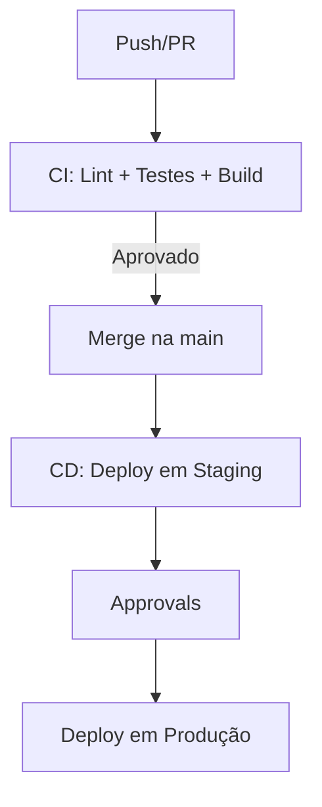
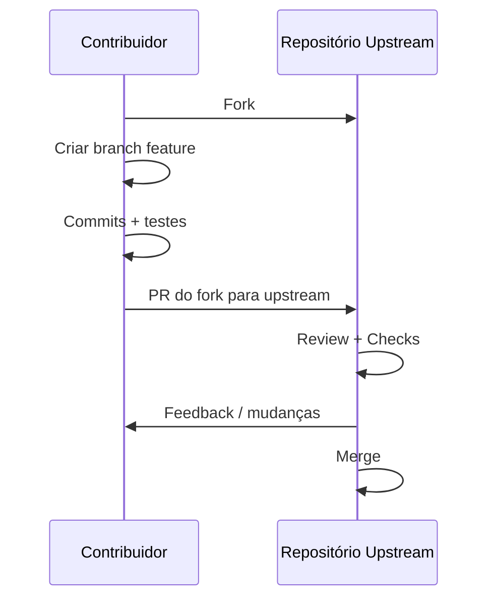

# Prompt
"Elabore um e-book completo sobre 'Melhores Práticas no Uso do GitHub para Desenvolvedores de Software', abordando as seguintes seções:

Introdução ao GitHub e ao controle de versão
Boas práticas para commits e mensagens de commit
Gerenciamento de branches e merges
Uso de issues e pull requests para colaboração
Boas práticas para documentação de código
Uso de GitHub Actions para automação
Segurança e melhores práticas de autenticação
Exemplos de workflows e pipelines de CI/CD
Dicas para estruturar repositórios e projetos
Considerações sobre colaboração em projetos open-source

Inclua exemplos práticos e trechos de código para ilustrar cada seção.

Formato de saída: 

Documento em PDF
Com estrutura clara e sumário
Inclua ilustrações e diagramas quando necessário
Forneça uma seção de 'Perguntas Frequentes' ao final

Tamanho máximo do documento: 50 páginas

Estruture o e-book de forma lógica, começando com uma introdução geral ao GitHub, seguida por seções detalhadas sobre cada aspecto importante do uso do GitHub para desenvolvimento de software."

# Adapta - ChatGPT

## E-book: Melhores Práticas no Uso do GitHub para Desenvolvedores de Software

Autor: GPT 5 (OpenAI)

Versão: 1.0

Resumo: Este e-book reúne práticas modernas e comprovadas para tirar o máximo do GitHub no ciclo de vida de desenvolvimento de software: versionamento, colaboração, automação (CI/CD), segurança, documentação e participação em open-source. Inclui exemplos práticos, snippets de código, templates e diagramas.

Observação sobre o PDF: Posso transformar este conteúdo em PDF para você. Se preferir que eu gere um arquivo final, me diga o formato (Markdown, DOCX ou PDF). Alternativamente, você pode:
- Copiar o conteúdo para seu editor favorito (por exemplo, VS Code, Google Docs ou Word) e exportar como PDF.
- Se quiser que eu formate com capa e sumário automático para PDF, avise que preparo um conteúdo compatível com exportação.

---

## Sumário

1. Introdução ao GitHub e ao controle de versão  
2. Boas práticas para commits e mensagens de commit  
3. Gerenciamento de branches e merges  
4. Uso de issues e pull requests para colaboração  
5. Boas práticas para documentação de código  
6. Uso de GitHub Actions para automação  
7. Segurança e melhores práticas de autenticação  
8. Exemplos de workflows e pipelines de CI/CD  
9. Dicas para estruturar repositórios e projetos  
10. Considerações sobre colaboração em projetos open-source  
11. Perguntas Frequentes (FAQ)

---

## 1. Introdução ao GitHub e ao controle de versão

### 1.1 O que é Git e o que é GitHub
- Git é um sistema distribuído de controle de versão. Permite rastrear mudanças, criar branches, fazer merges e colaborar com segurança.
- GitHub é uma plataforma hospedada que adiciona recursos de colaboração (issues, pull requests, code review), automação (Actions), segurança (Dependabot, code scanning), gestão (Projects), documentação (Wikis, Pages) e governança (orgs, teams, branch protection).

### 1.2 Por que usar GitHub
- Centraliza código, discussões, planejamento e automação em um só lugar.
- Fluxos de revisão e auditoria robustos.
- Integra com ferramentas de CI/CD, segurança e pacotes (GitHub Packages).
- Comunidade e padrões do ecossistema open-source.

### 1.3 Conceitos essenciais
- Commit, branch, tag, merge e rebase.
- Forks vs. branches internos.
- Pull Request (PR) e code review.
- Proteção de branches e checks obrigatórios.
- GITHUB_TOKEN e secrets para automação.

---

## 2. Boas práticas para commits e mensagens de commit

### 2.1 Commits pequenos e atômicos
- Faça commits que encapsulem uma mudança lógica (uma correção, um refactor, um teste).
- Evite commits volumosos e mistos (feature + refactor + formatação).

### 2.2 Mensagens claras e padronizadas
- Regra de ouro:
  - Título no imperativo e conciso (até ~72 chars).
  - Corpo explicando o porquê, contexto e implicações.
  - Referencie issues: “Refs #123”, “Closes #123”.

Exemplo (simples):
```
Corrige atraso no carregamento da página inicial

- Otimiza consulta ao repositório
- Adiciona índices no banco
- Closes #231
```

### 2.3 Conventional Commits (recomendado)
- Padronize mensagens para facilitar versões semânticas e changelogs.

Exemplos:
```
feat(api): adiciona endpoint de listagem de pedidos

fix(auth): corrige expiração antecipada do token (#87)

docs(readme): atualiza instruções de instalação

refactor(orders): extrai serviço de cálculo de frete

chore(ci): adiciona cache do pip
```

- Tipos comuns: feat, fix, docs, style, refactor, perf, test, build, ci, chore, revert.
- Use escopos úteis, ex.: feat(ui), fix(db), ci(deploy).

### 2.4 Assinatura, co-autoria e DCO
- Com co-autoria:
```
Co-authored-by: Nome Sobrenome <email@exemplo.com>
```
- DCO (Developer Certificate of Origin) com sign-off:
```
git commit -s -m \"feat: implementa X\"
```

### 2.5 Boas práticas de diff
- Use .editorconfig, linters e formatação automática para diffs limpos.
- Evite commits que só reformatam junto com mudanças funcionais; separe.

---

## 3. Gerenciamento de branches e merges

### 3.1 Estratégias de branching
- Trunk-based (recomendada na maioria dos casos):
  - Branch principal (main) protegida.
  - Branches curtas por tarefa/feature.
  - Merge frequente (evita “merge hell”).
- Git Flow (útil em cenários com releases formais e manutenção longa):
  - main, develop, feature/*, release/*, hotfix/*.
- Release branches:
  - Abra branch release/x.y para estabilização antes do corte da versão.
- Hotfix branch:
  - Correções críticas sobre a versão em produção com PR e cherry-pick se necessário.

### 3.2 Rebase vs. merge
- Rebase (limpa histórico, linear) em branches próprias antes de abrir PR.
- Merge commit (mantém histórico exato) — útil quando quer preservar contexto de múltiplos merges.
- Squash merge: ideal para condensar commits ruidosos de uma feature em 1 commit.

Diretriz prática:
- Durante o desenvolvimento: rebase sua branch a partir de main.
- Ao concluir: use squash merge se os commits forem muitos e pouco semânticos; caso contrário, merge commit.

### 3.3 Proteções de branch
- Exija revisões e checks verdes.
- Bloqueie push direto na main.
- Ative “Require linear history” se adotar squash/rebase.
- Habilite “Dismiss stale approvals” após novos commits.
- Use CODEOWNERS para revisores obrigatórios.

### 3.4 Diagrama (Mermaid) do fluxo recomendado


---

## 4. Uso de issues e pull requests para colaboração

### 4.1 Issues
- Use templates para padronizar relatos e solicitações.
- Labels (bug, enhancement, question, good first issue, priority:high).
- Milestones para agrupar por release.
- Projects para roadmap e priorização.
- Feche issues via PRs com “Closes #ID” no corpo ou título.

Exemplo de template de issue (BUG):
```markdown
---
name: Reportar bug
about: Descreva um problema para ajudar a melhorar
labels: bug
---

Descrição
Passos para reproduzir
1.
2.
3.

Comportamento esperado

Capturas de tela / logs

Ambiente
- OS:
- Versão:

Contexto adicional
```

### 4.2 Pull Requests (PRs)
- Template de PR com checklist de qualidade.
- Solicite revisão de CODEOWNERS e time responsável.
- Vincule issues: “Closes #123”.
- Inclua captura, logs, ou GIF quando UI.

Exemplo de template de PR:
```markdown
## Descrição
Explique a mudança e o porquê.

## Tipo de mudança
- [ ] Bugfix
- [ ] Nova feature
- [ ] Breaking change
- [ ] Documentação

## Checklist
- [ ] Testes adicionados/atualizados
- [ ] Documentação atualizada
- [ ] Lint/format passou localmente
- [ ] Issue vinculada (se aplicável)
```

### 4.3 Boas práticas de review
- Seja específico, respeitoso e focado em fatos.
- Prefira perguntas a ordens; explique trade-offs.
- Aprove PRs pequenos rapidamente; grandes PRs exigem mais contexto.
- Utilize “suggested changes” no GitHub para ajustes simples.
- Marque conversas como resolvidas quando endereçadas.

---

## 5. Boas práticas para documentação de código

### 5.1 README e documentos essenciais
- README.md: o que é, por que existe, como rodar, como contribuir, status do build, badges.
- CONTRIBUTING.md: como abrir issues/PRs, padrões de commit, testes, linters, guia de estilo.
- CODE_OF_CONDUCT.md: comportamento esperado (ex.: Contributor Covenant).
- SECURITY.md: como reportar vulnerabilidades, SLAs.
- LICENSE: licença clara (MIT, Apache-2.0, GPL, etc.).
- SUPPORT.md: canais de suporte, SLA, escopo.
- CHANGELOG.md: mudanças por versão (semver).

### 5.2 Documentação técnica
- ADRs (Architecture Decision Records): decisões e contexto. Exemplo:
```markdown
# ADR 001: Escolha do PostgreSQL
Data: 2025-01-10
Status: Aceita

Contexto
Decisão
Consequências
```
- Comentários úteis e concisos no código. Evite redundância com nomes claros e testes.

### 5.3 Wiki e GitHub Pages
- Use Wiki para conhecimento amplo e duradouro.
- GitHub Pages + MkDocs/Docusaurus para site de docs. Exemplo MkDocs:
```yaml
site_name: Projeto XYZ
theme:
  name: material
nav:
  - Início: index.md
  - Guia:
    - Instalação: guia/instalacao.md
    - Uso: guia/uso.md
```

### 5.4 Padrões de formatação
- .editorconfig para padronizar indentação, encoding, EOL.
- Linters e formatadores automáticos (ESLint/Prettier, Black/Flake8, golangci-lint, etc.).

---

## 6. Uso de GitHub Actions para automação

### 6.1 Conceitos
- Workflows: arquivos YAML em .github/workflows.
- Jobs, steps e runners (Ubuntu, Windows, macOS).
- GITHUB_TOKEN e secrets.
- Events: push, pull_request, schedule, workflow_dispatch, release.
- Reusable workflows com “workflow_call”.

### 6.2 Boas práticas
- Princípio do menor privilégio em permissions:
```yaml
permissions:
  contents: read
```
- Subir permissões apenas quando necessário (por exemplo, para liberar versão):
```yaml
permissions:
  contents: write
  packages: write
```
- Use cache para acelerar builds.
- Matriz de versões/OS para compatibilidade.
- Concurrency para evitar pipelines obsoletos:
```yaml
concurrency:
  group: ${{ github.workflow }}-${{ github.ref }}
  cancel-in-progress: true
```

### 6.3 Diagramas (Mermaid) do fluxo CI/CD


---

## 7. Segurança e melhores práticas de autenticação

### 7.1 Autenticação forte
- Habilite 2FA em contas pessoais e obrigue em organizações.
- Use Single Sign-On (SSO) empresarial quando disponível.

### 7.2 Chaves e tokens
- Prefira GITHUB_TOKEN para Actions (escopo controlado) ao invés de PATs.
- Quando precisar de PAT, use tokens de escopo reduzido e com expiração.
- Use OpenID Connect (OIDC) para credenciais em cloud sem armazenar secrets.

### 7.3 Assinatura de commits
- Assine commits com GPG ou com chaves SSH assinadas.
- Exemplo de configuração GPG:
```bash
gpg --full-generate-key
gpg --list-secret-keys --keyid-format LONG
git config --global user.signingkey <KEYID>
git config --global commit.gpgsign true
```

### 7.4 Proteções no repositório
- Branch protection: revisões obrigatórias, checks, code owners.
- Secret scanning e push protection: bloqueiam segredos acidentalmente.
- Dependabot alerts e auto-merge para patches seguros.
- Code scanning (CodeQL) para vulnerabilidades.

### 7.5 Política de segurança
- SECURITY.md: como reportar vulnerabilidades de forma privada.
- Responda rapidamente a reports; registre CVEs quando aplicável.

---

## 8. Exemplos de workflows e pipelines de CI/CD

### 8.1 Node.js (lint, test, build, cache)
```yaml
name: CI Node.js

on:
  push:
    branches: [ main ]
  pull_request:

permissions:
  contents: read

jobs:
  build:
    runs-on: ubuntu-latest
    strategy:
      matrix:
        node-version: [18.x, 20.x]
    steps:
      - uses: actions/checkout@v4
      - uses: actions/setup-node@v4
        with:
          node-version: ${{ matrix.node-version }}
          cache: 'npm'
      - run: npm ci
      - run: npm run lint
      - run: npm test -- --ci
      - run: npm run build
```

### 8.2 Python (pytest + cache pip)
```yaml
name: CI Python

on:
  pull_request:
  push:
    branches: [ main ]

jobs:
  test:
    runs-on: ubuntu-latest
    steps:
      - uses: actions/checkout@v4
      - uses: actions/setup-python@v5
        with:
          python-version: '3.12'
          cache: 'pip'
      - run: pip install -r requirements.txt
      - run: pytest -q --disable-warnings
```

### 8.3 Docker: build e push para GitHub Container Registry
```yaml
name: Build & Push Docker

on:
  push:
    tags:
      - 'v*.*.*'

permissions:
  contents: read
  packages: write

jobs:
  docker:
    runs-on: ubuntu-latest
    steps:
      - uses: actions/checkout@v4
      - uses: docker/setup-buildx-action@v3
      - uses: docker/login-action@v3
        with:
          registry: ghcr.io
          username: ${{ github.actor }}
          password: ${{ secrets.GITHUB_TOKEN }}
      - uses: docker/build-push-action@v6
        with:
          push: true
          tags: ghcr.io/${{ github.repository }}:${{ github.ref_name }}
          cache-from: type=registry,ref=ghcr.io/${{ github.repository }}:cache
          cache-to: type=registry,ref=ghcr.io/${{ github.repository }}:cache,mode=max
```

### 8.4 Release automático (Conventional Commits + SemVer)
```yaml
name: Release

on:
  push:
    branches: [ main ]

permissions:
  contents: write

jobs:
  release:
    runs-on: ubuntu-latest
    steps:
      - uses: actions/checkout@v4
        with:
          fetch-depth: 0
      - name: Setup Node
        uses: actions/setup-node@v4
        with:
          node-version: 20
      - run: npm ci
      - run: npx semantic-release
        env:
          GITHUB_TOKEN: ${{ secrets.GITHUB_TOKEN }}
```

### 8.5 Deploy para GitHub Pages (site de docs)
```yaml
name: Deploy Docs

on:
  push:
    branches: [ main ]

permissions:
  contents: read
  pages: write
  id-token: write

concurrency:
  group: pages
  cancel-in-progress: false

jobs:
  build:
    runs-on: ubuntu-latest
    steps:
      - uses: actions/checkout@v4
      - uses: actions/setup-node@v4
        with:
          node-version: 20
      - run: npm ci
      - run: npm run build-docs
      - uses: actions/upload-pages-artifact@v3
        with:
          path: ./dist
  deploy:
    needs: build
    runs-on: ubuntu-latest
    environment:
      name: github-pages
      url: ${{ steps.deployment.outputs.page_url }}
    steps:
      - id: deployment
        uses: actions/deploy-pages@v4
```

### 8.6 Reusable workflow (padronize CI entre repositórios)
Arquivo chamado em .github/workflows/reusable-ci.yml:
```yaml
name: Reusable CI
on:
  workflow_call:
    inputs:
      node-version:
        required: false
        type: string
        default: '20'
jobs:
  ci:
    runs-on: ubuntu-latest
    steps:
      - uses: actions/checkout@v4
      - uses: actions/setup-node@v4
        with:
          node-version: ${{ inputs.node-version }}
          cache: 'npm'
      - run: npm ci
      - run: npm test -- --ci
```
E chame assim no repo consumidor:
```yaml
name: Project CI
on: [push, pull_request]
jobs:
  call-reusable:
    uses: org/repo/.github/workflows/reusable-ci.yml@main
    with:
      node-version: '18'
```

### 8.7 CodeQL (code scanning)
```yaml
name: CodeQL

on:
  push:
    branches: [ main ]
  pull_request:
  schedule:
    - cron: '0 3 * * 1'

permissions:
  contents: read
  security-events: write

jobs:
  analyze:
    runs-on: ubuntu-latest
    steps:
      - uses: actions/checkout@v4
      - uses: github/codeql-action/init@v3
        with:
          languages: 'javascript,python'
      - uses: github/codeql-action/analyze@v3
```

### 8.8 Dependabot
Arquivo .github/dependabot.yml:
```yaml
version: 2
updates:
  - package-ecosystem: npm
    directory: '/'
    schedule:
      interval: weekly
    open-pull-requests-limit: 5
  - package-ecosystem: pip
    directory: '/'
    schedule:
      interval: weekly
```

---

## 9. Dicas para estruturar repositórios e projetos

### 9.1 Estrutura de pastas sugerida
```
.
├─ .github/
│  ├─ workflows/
│  ├─ ISSUE_TEMPLATE/
│  ├─ PULL_REQUEST_TEMPLATE.md
│  ├─ CODEOWNERS
├─ docs/
├─ src/
├─ tests/
├─ scripts/
├─ infra/
├─ examples/
├─ .editorconfig
├─ .gitattributes
├─ .gitignore
├─ LICENSE
├─ README.md
├─ CONTRIBUTING.md
├─ CODE_OF_CONDUCT.md
├─ SECURITY.md
```

### 9.2 CODEOWNERS
- Garanta revisões obrigatórias por área.
Exemplo:
```
# Donos por diretório
/src/api/ @time-backend
/src/ui/  @time-frontend
/docs/    @tech-writers
```

### 9.3 .gitattributes e LFS
- Defina EOLs e arquivos binários.
```
* text=auto eol=lf
*.sh text eol=lf
*.bat text eol=crlf
*.png binary
```
- Use Git LFS para arquivos grandes:
```bash
git lfs track \"*.psd\"
```

### 9.4 Monorepo vs. multi-repo
- Monorepo:
  - Prós: visibilidade, refactors atômicos, CI unificado.
  - Contras: CI mais pesado, gerenciamento de owners complexo.
- Multi-repo:
  - Prós: isolamento, autonomia de time.
  - Contras: coordenação entre versões, duplicação de configs.

### 9.5 Templates e padronização
- Use template repositories para novos serviços/projetos.
- Reutilize workflows (workflow_call).
- Aplique linting e formatação em pre-commit hooks (Husky, pre-commit).

---

## 10. Considerações sobre colaboração em projetos open-source

### 10.1 Licenciamento e governança
- Defina licença clara (MIT/Apache-2.0 comuns para OSS).
- CODE_OF_CONDUCT e CONTRIBUTING para definir regras e expectativas.
- Mantenha transparência sobre roadmap e governança (MAINTAINERS.md).

### 10.2 Onboarding de contribuidores
- Labels: good first issue, help wanted.
- Issues bem descritas e “scoped”.
- Templates de PR e respostas acolhedoras.

### 10.3 Triagem e releases
- Use milestones para releases.
- Gere CHANGELOG e GitHub Releases com notas claras.
- Automatize merges de dependências seguras com Dependabot + auto-merge.

### 10.4 CLA e DCO
- Alguns projetos exigem CLA (CLA Assistant) ou DCO (-s).
- Documente na CONTRIBUTING.

### 10.5 Diagrama (Mermaid) do fluxo de contribuição via fork


---

## Exemplos práticos e trechos de código por seção

Para facilitar o uso imediato, aqui estão blocos práticos “copiar e colar” citados ao longo do e-book.

### A. Git hooks e Husky (Node)
package.json:
```json
{
  \"scripts\": {
    \"prepare\": \"husky install\",
    \"lint\": \"eslint .\",
    \"format\": \"prettier --check .\",
    \"test\": \"vitest run\"
  },
  \"devDependencies\": {
    \"husky\": \"^9.0.0\",
    \"eslint\": \"^9.0.0\",
    \"prettier\": \"^3.0.0\",
    \"vitest\": \"^2.0.0\"
  }
}
```
Crie hook:
```bash
npx husky add .husky/pre-commit \"npm run lint && npm test\"
git add .husky/pre-commit
```

### B. Template de pull_request_template.md
```markdown
## Contexto
Descreva o problema e a solução proposta.

## Mudanças
- [x] Item
- [ ] Item

## Impacto
Quebra compatibilidade? Migrar algo?

## Screenshots/Logs
Se aplicável.

## Como testar
Passos objetivos.

## Referências
Closes #ID, Refs #ID
```

### C. Branch protection settings (guia rápido)
- Require pull request reviews: 1–2 aprovadores.
- Require status checks to pass: “CI Node.js”, “CodeQL”, etc.
- Require conversation resolution.
- Require signed commits (opcional, recomendado).
- Restrict who can push to matching branches: somente bots seguros e admins.

### D. Clonagem, PR e atualização via rebase (exemplo)
```bash
git checkout -b feature/melhoria-xyz
# ... edições
git add .
git commit -m \"feat(xyz): implementa melhoria\"
git fetch origin
git rebase origin/main
git push -u origin feature/melhoria-xyz
# Abra PR no GitHub
```

### E. Fechando issue via PR
No corpo do PR:
```
Closes #123
```

---

## Boas práticas avançadas

### Observabilidade de pipelines
- Nomeie steps e jobs claramente.
- Use outputs entre jobs para passar artefatos/metadados.
- Armazene artefatos de build e relatórios de cobertura.

### Ambientes e approvals
- Use Environments (staging, production) com proteção de aprovação.
- Registre variáveis e secrets por ambiente.

### OIDC para clouds (ex.: AWS)
- Crie role em nuvem confiando no provedor OIDC do GitHub.
- Em Actions, assuma a role sem guardar secret estática:
```yaml
permissions:
  id-token: write
  contents: read
steps:
  - uses: actions/checkout@v4
  - uses: aws-actions/configure-aws-credentials@v4
    with:
      role-to-assume: arn:aws:iam::123456789012:role/GitHubOIDCRole
      aws-region: us-east-1
```

### Gestão de pacotes
- GitHub Packages (npm, maven, docker) com controle de acesso.
- Configure .npmrc/.pip/publish com tokens do GITHUB_TOKEN quando possível.

---

## Seção de Ilustrações e Diagramas

Quando útil, incluímos diagramas Mermaid. Ao exportar para PDF, se o renderizador não suportar Mermaid, você pode:
- Usar uma extensão do VS Code que renderize Mermaid e exporte para PDF.
- Converter os diagramas para imagens usando alguma ferramenta e inserir no documento final.

Exemplo ASCII simples do fluxo de PR:
```
[Issue] -> [Branch feature] -> [Commits] -> [PR] -> [Review + Checks] -> [Merge] -> [Deploy]
```

---

## Apêndice: Arquivos úteis de exemplo

### .editorconfig
```
root = true

[*]
charset = utf-8
end_of_line = lf
insert_final_newline = true
indent_style = space
indent_size = 2

[*.py]
indent_size = 4
```

### .gitignore (Node + Python exemplo combinado)
```
# Node
node_modules/
dist/
coverage/
.npm/

# Python
__pycache__/
*.pyc
.venv/
.env

# OS
.DS_Store
Thumbs.db

# IDE
.vscode/
.idea/
```

### SECURITY.md (modelo simples)
```markdown
# Segurança

Se você encontrar uma vulnerabilidade, por favor reporte em privado para security@exemplo.com.
Nos comprometemos a responder em até 48h e publicar correções assim que possível.
```

---

## 11. Perguntas Frequentes (FAQ)

1) Devo usar rebase ou merge?
- Use rebase para manter sua branch atualizada com main antes do PR, mantendo histórico linear local. Para concluir PR, escolha:
  - Squash merge quando há muitos commits pequenos.
  - Merge commit quando quer preservar histórico e contexto.
  - Evite “rebase and merge” em branches protegidas com histórico compartilhado para não reescrever histórico público.

2) Quando usar fork vs. branch no mesmo repo?
- Fork: contribuições externas ou quando não há permissão de escrita no repo.
- Branch: contribuições internas na mesma organização/equipe.

3) Como lidar com segredos em Actions?
- Use secrets de repositório/ambiente. Prefira GITHUB_TOKEN com permissões mínimas.
- Use OIDC para clouds, evitando armazenar chaves estáticas.

4) PAT ou GITHUB_TOKEN?
- Prefira GITHUB_TOKEN em workflows. Use PAT apenas quando necessário (ex.: escopos fora do alcance do GITHUB_TOKEN) e com expiração curta.

5) O que é melhor: monorepo ou multi-repo?
- Depende do contexto. Monorepo facilita refactors e padronização; multi-repo dá autonomia e isolamento. Avalie tamanho, times e ferramentas.

6) Como recuperar de um push errado?
- Se foi local: git reflog ajuda a encontrar commits perdidos.
- Se foi remoto: crie um PR revertendo ou contate administradores; evite force push em branches protegidas.

7) Como evitar PRs gigantes?
- Divida em pequenas unidades; feature flags podem liberar incrementos.
- Revise cedo e com frequência.

8) Como lidar com arquivos grandes?
- Use Git LFS para binários grandes. Evite commitar artefatos de build.

9) Posso exigir commits assinados?
- Sim, habilite “Require signed commits” em branch protection. Configure GPG ou SSH signing localmente.

10) Como garantir qualidade de código?
- Linters, formatação automática, cobertura de testes, code review disciplinado e checks obrigatórios no CI.

11) Como gerenciar releases?
- Adote SemVer, tags vX.Y.Z, changelog automatizado (semantic-release), releases no GitHub com notas detalhadas.

12) Como estruturar um bom README?
- Descrição, badges, instalação, uso, configuração, testes, suporte, licença, contribuições.

13) Como padronizar PRs e issues?
- Use templates em .github/ISSUE_TEMPLATE e PULL_REQUEST_TEMPLATE.md.
- Labels e projetos para priorização.

14) Como adotar ambientes e aprovações?
- Crie Environments (staging/prod) e adicione “required reviewers” para deploys críticos.

15) Como habilitar varredura de vulnerabilidades?
- Ative Dependabot security updates, CodeQL e secret scanning nas configurações do repositório.

---

## Conclusão

Com processos de commits bem definidos, branching disciplinado, PRs transparentes, documentação clara, automação robusta com GitHub Actions e foco em segurança, seu time ganha previsibilidade, velocidade e confiança na entrega.

Se você quiser, eu:
- Gero a versão final em PDF com capa e sumário.
- Adapto os exemplos para sua stack (Node, Python, Java, Go, .NET, etc.).
- Crio um repositório-template completo (.github, workflows, templates, CODEOWNERS, linters).

Deseja que eu entregue este e-book como PDF agora? Se sim, diga se prefere incluir capa personalizada (título, subtítulo, autor e data) e eu preparo o arquivo final.
